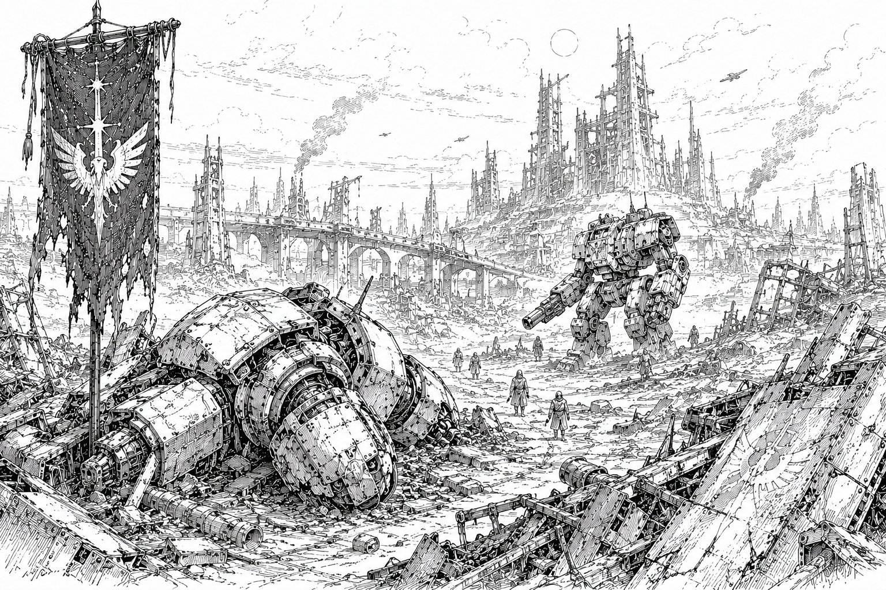

# The Dark Age

The Dark Age was the turbulent period that followed the [Fall](the-empire.md#the-fall) of the [Empire](the-empire.md). Lasting for several centuries, it was marked by political fragmentation, economic collapse, isolation, and near-constant conflict. With the destruction of the Empire's government, military, and communications infrastructure, no authority remained capable of maintaining order across the [Core](../).

For many historians, the Dark Age represents the lowest point in recorded human history.

## Origins

The Dark Age began with the [Fall](the-empire.md#the-fall) of the [Empire](the-empire.md) and the invasion of human space by the Ophidian Supremacy. Though details remain uncertain, historical records indicate that the Empire's military was shattered during the conflict and that much of the Empire's political and administrative structure ceased functioning within a relatively short period of time.

The exact sequence of events remains one of the greatest mysteries in human history. Surviving records from the era are fragmented, contradictory, and often separated by centuries of copying and interpretation. As a result, historians disagree on the precise causes and timeline of the Empire's collapse.

Despite these uncertainties, most scholars agree that the destruction of the Empire created a power vacuum on a scale never before seen. Within a few generations, the institutions that had governed humanity for centuries had either disappeared entirely or been reduced to isolated remnants.

## The Ophidian Occupation

The Dark Age is sometimes characterized as the period of Ophidian occupation that followed the [Fall](the-empire.md#the-fall) of the [Empire](the-empire.md).

According to traditional accounts, the Ophidian Supremacy occupied large portions of the Core for several generations following its victory over the Empire. However, determining the true extent of this occupation has proven nearly impossible.

By the time surviving records become available, communications between worlds had largely collapsed, interstellar travel had become increasingly dangerous, and countless systems were already fighting for their own survival. Nearly every region of the Core experienced political fragmentation, warfare, piracy, famine, or economic collapse. Because of this, historians struggle to distinguish between worlds that were directly occupied by Ophidian forces and worlds that simply collapsed as a consequence of the Empire's destruction.

Some records describe entire sectors being abandoned due to fears of Ophidian activity. Others suggest that vast regions of space were deliberately avoided, with travelers choosing longer routes rather than risk entering territory rumored to be under Ophidian control. Yet despite these accounts, very little direct evidence of the Supremacy has ever been discovered.

As a result, many questions remain unanswered. Which worlds were occupied? How many Ophidian forces remained in the Core following the Fall? How were they eventually defeated? Historians continue to debate these questions, and no consensus has emerged.

## The Collapse of Civilization

Entire fleets vanished during the Fall. Some were destroyed outright, while others fled into deep space and were never seen again. The communications networks that had once linked thousands of worlds fell silent. Trade routes collapsed. Administrative institutions ceased to function. In the span of only a few generations, much of human civilization lost contact with itself.

For many worlds, the Fall was not a single event but the beginning of a slow and relentless decline.

Without reliable communication between systems, rumors and paranoia flourished. Few knew which worlds had survived, which had fallen, or whether the Ophidians still occupied parts of the Core. Entire sectors became avoided regions as travelers feared drawing attention to themselves or unknowingly entering hostile territory.

Many populations abandoned major cities and population centers, believing that large concentrations of people would attract invaders. Communities retreated into remote settlements, underground facilities, isolated valleys, and hidden colonies where they hoped to avoid notice.

## Famine and Economic Breakdown

The collapse of interstellar trade proved devastating.

Many worlds had spent centuries specializing within the Empire's economy. Agricultural worlds produced food for entire sectors, while industrial worlds manufactured machinery, starship components, and advanced technology. When shipping ceased, these systems broke down almost overnight.

Food shortages became widespread. Entire populations were forced to ration supplies, abandon settlements, or compete violently for dwindling resources. Some colonies simply disappeared from the historical record. Whether they were destroyed, abandoned, or merely lost remains unknown.

Technologically sophisticated worlds often suffered particularly severe collapses. Their populations possessed highly specialized knowledge but frequently lacked the practical skills necessary to survive without the vast support networks that had sustained them. Power grids failed. Manufacturing facilities shut down. Medical systems collapsed. On many worlds, descendants of advanced civilizations found themselves struggling merely to survive.

## The Age of Warlords

The disappearance of galactic authority created a power vacuum that was quickly filled by local strongmen, military commanders, pirate kings, and warlords.

Across the Core, thousands of conflicts erupted as factions fought over surviving infrastructure, military stockpiles, agricultural land, and population centers. Alliances were often temporary. Borders shifted constantly. Few governments survived for more than a generation.

Some warlords ruled only a single city or moon. Others commanded fleets capable of threatening entire sectors. Many claimed to be the legitimate heirs of the Empire, while others openly embraced piracy and conquest.

For ordinary citizens, survival often depended less upon law and more upon whichever armed force happened to control their region at the time.

## Bastions of Survival

Despite the chaos, a handful of civilizations endured.

### The Imperium

The [Imperium](../../factions/omnisphere-imperium.md) survived by retreating inward. Closing its borders and abandoning much of its former territory, it consolidated its population around roughly a dozen heavily defended worlds.

Protected by ancient fortifications, disciplined institutions, and a deeply rooted cultural identity, the Imperium weathered the chaos largely intact. Though diminished, it preserved more continuity with the pre-Fall era than almost any other surviving power.

### The Starcrest Protectorate

The [Starcrest Protectorate](../../factions/starcrest-protectorate.md) traces its origins to this period as well.

Originally established as a defensive frontier command tasked with resisting the Ophidians, it became increasingly isolated as communications with the wider galaxy disappeared. Over time, the military expedition evolved into a self-governing state dedicated to protecting the handful of worlds that remained under its control.

Through discipline, sacrifice, and constant vigilance, it survived where many others did not.

### The Orion Corporate

The [Orion Corporate](../../factions/orion-corporate.md) also emerged during the Dark Age. The term *Corporate* in Core terminology refers to a mutual defense pact.

Faced with escalating raids, piracy, and regional warfare, three neighboring worlds formed a defensive alliance dedicated to collective security and scientific cooperation. Through technological innovation and careful resource management, the alliance successfully defended itself against external threats and gradually expanded to include additional worlds.

By the end of the Dark Age, the Orion Corporate had become one of the most stable and prosperous regions in the recovering Core.

## Legacy

Despite isolated successes, the Dark Age remained a period defined by instability and survival. Most worlds were concerned not with rebuilding civilization, but with enduring another year.

Entire cultures vanished. Countless worlds were abandoned. Technologies were lost. Historical records were destroyed. Even centuries later, modern scholars continue to uncover forgotten colonies, abandoned cities, and remnants of civilizations that disappeared during this era.

The modern Core was shaped as much by what was lost during the Dark Age as by what survived it.

Only with the eventual rise of the [Great Houses](../../factions/) and the formation of the Stellar Conclave would humanity begin its long recovery from the devastation of the [Fall](the-empire.md#the-fall).
