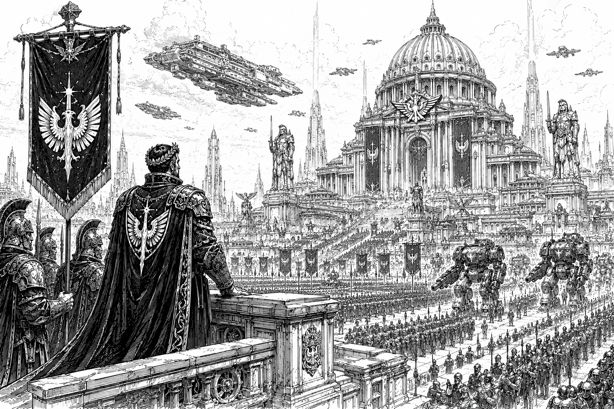

# The Empire

The Age of Empire represents the high-water mark of human civilization.

For nearly two millennia, the Golden Empire united thousands of worlds through trade, administration, military power, and shared institutions. Its influence stretched across known space, connecting distant systems into a single political and economic order. Even centuries after its destruction, the Empire remains the foundation upon which nearly every modern government, culture, and institution in the Core is built.

To many, the Empire is remembered as a golden age of stability, prosperity, and technological achievement. Whether that memory is entirely deserved remains a matter of debate.

## Overview

Nearly every government in the modern [Core](../) claims some degree of legitimacy through a connection to the Empire. Dynasties trace their bloodlines to Empire-era nobility, governments preserve fragments of Empire law, and military traditions often claim descent from Empire-era doctrine. Yet few truly understand the systems that allowed the Empire to function.

The Empire remains the longest-lasting and most influential political entity in recorded history. Built gradually over centuries of expansion and consolidation, it governed a population vastly larger than that of the modern Core and possessed technological and industrial capabilities that modern powers struggle to comprehend.

Reliable records from the era are scarce. What survives consists largely of fragmented archives, damaged data stores, oral traditions, and archaeological discoveries. Even so, surviving evidence suggests that the Empire's military dwarfed all modern forces combined.

Fleet records indicate that Empire naval forces may have operated as many as one hundred BattleStars at their height. By comparison, the modern Core maintains only twelve. More importantly, the industrial infrastructure and scientific expertise required to construct vessels of that scale no longer exist.

Many technologies commonly used today are understood only in part, maintained through inherited procedures and generations of accumulated experience rather than complete scientific understanding. The Empire created wonders that its descendants can repair, replicate, and occasionally improve—but rarely fully explain.

## Governance

The Golden Empire was ruled by the Star Emperor, who served as the supreme political, military, and administrative authority of the known galaxy. While the Emperor possessed ultimate authority, the Empire itself was not governed as a single centralized state. Instead, it functioned through a vast hierarchy of noble houses, regional governments, and local institutions that administered Empire territory on behalf of the throne.

The Empire encompassed all of what is now known as the [Core](../) and is believed to have extended far beyond it. Many worlds currently considered Fringe, or Frontier, or otherwise peripheral territories were likely fully integrated Empire's provinces during its height. The true extent of Empire territory remains unknown, as surviving records from the era are fragmentary and often contradictory.

Beneath the Star Emperor existed a complex network of noble houses that governed regions of Empire space as vassals. These houses controlled planets, systems, and entire sectors while owing loyalty, taxes, military service, and political obedience to the Empires government. Unlike the Great Houses of the modern Core, Empire-era houses were generally smaller in territorial scope and political influence. Power was distributed among a far greater number of noble families, creating a highly layered political structure that balanced local autonomy against the Empire's authority.

Many of these houses disappeared during the Fall and the centuries that followed. Some were destroyed outright, while others were absorbed into larger powers or faded into obscurity. A handful survived and continue to exist in altered forms to this day, though few retain more than fragments of their former influence.

Much of what is known about Empire-era governance originates from records preserved by the Imperium. Of the major powers that exist today, the Imperium is unique in having existed before, during, and after the Age of Empire. Long before the rise of the Star Emperor, the Imperium was itself an independent interstellar empire. At some point during the Empire's early expansion, it conquered and absorbed the Imperium.

Though proud of its ancient heritage, the Imperium ultimately became one vassal among many within the larger Empire. During the Age of Empire, the territory controlled by the [Imperium](../../factions/omnisphere-imperium.md) was significantly smaller than the territory it governs today. Nevertheless, its institutions, traditions, and historical archives survived where those of many other houses did not.

This historical continuity has given the Imperium considerable influence over modern understanding of the Empire. As a result, many accepted accounts of Empire-era government, law, and society originate from Imperial records preserved by the Imperium itself, leading some historians to question whether modern interpretations of the Empire may reflect an Imperium-centered perspective.

In many ways, the modern Core represents the opposite of the Empire's political structure. The Empire governed a vast territory through hundreds of noble houses of varying size and influence. The modern Core, by contrast, is dominated by only a handful of Great Houses, each controlling territories and resources that would have rivaled entire sectors of the old Empire. While the modern houses are fewer in number, they are individually far larger and more powerful than most of their Empire-era predecessors.

Indeed, had the Great Houses exited in the Empires-era, they would each be considered super powers. The political fragmentation that followed the Fall did not create smaller states—it created fewer, larger ones.

## The Fall

For all its apparent permanence, the Empire ultimately fell.

According to accepted history, the Empire was invaded and destroyed by a mysterious power known as the Ophidian Supremacy sometime around 4000 AE. The details of this conflict remain among the greatest mysteries in human history.

What little evidence survives presents a troubling contradiction. Historical accounts describe the Supremacy as a force capable of defeating the largest military civilization humanity had ever produced. Yet virtually no evidence exists of a civilization large enough to accomplish such a feat. No vast chain of conquered worlds marks their advance. No major archaeological sites can be definitively linked to them. No surviving fleet wrecks, cities, or industrial centers have been identified with certainty.

Most surviving accounts agree on one point: the Empire's collapse was shockingly rapid.

The Empire had endured for centuries and possessed military forces that were widely regarded as invincible. Its famed knights, BattleStar fleets, and vast administrative institutions had maintained order across thousands of worlds for generations. Yet in the face of the Ophidian invasion, these seemingly eternal structures collapsed with alarming speed. Entire sectors disappeared from communication. Fleets vanished. Worlds were abandoned. Within a relatively short period of time, the Empire ceased to function as a unified state.

Exactly how the Supremacy achieved this remains unknown.

The official historical narrative holds that the Supremacy occupied much of the [Core](../) for several generations before eventually being defeated by Empire forces operating from exile. These returning exiles would later restore order, establish the Stellar Conclave, and lay the foundations of the modern political order.

Yet even this account raises uncomfortable questions.

If the Supremacy truly ruled the Core for generations, why have so few traces of their civilization been discovered? Why do surviving records from the period contain so many contradictions? And how could a civilization capable of conquering humanity's greatest empire vanish so completely?

## The Last True Emperor

One of the few events from the Fall that remains broadly consistent across surviving historical traditions is the death of the Last True Emperor.

As the Empire collapsed, a massive evacuation fleet is said to have assembled and fled beyond the Core. Carrying refugees, soldiers, government officials, and surviving noble houses, the fleet represented the last hope of preserving what remained of the Empire.

Beyond these broad details, the historical record becomes uncertain.

The most popular tradition holds that the Emperor personally led the Empire's remaining military forces in a final battle against the pursuing Ophidian Supremacy. According to these accounts, he sacrificed himself to buy time for the evacuation fleet to escape into deep space. This event is remembered in countless stories, paintings, poems, and historical accounts as the Empire's final act of defiance.

Other traditions tell a darker story.

Some accounts suggest the Emperor was betrayed by rival nobles during the chaos of the Fall. Others claim he was assassinated by political enemies seeking to secure their own survival as the Empire collapsed around them. A handful of records even suggest he may have died before the evacuation fleet departed, with later generations inventing the story of a heroic last stand to provide a more inspiring ending to the Age of Empire.

Whatever the truth, all surviving accounts agree on one point: the Emperor died during the Fall.

His death marked more than the end of a ruler. It marked the end of the Empire itself.

With the death of the Last Emperor, the title of Star Emperor also passed from history. No successor was ever crowned. No claimant was ever recognized. The throne was left vacant.

The evacuation fleet survived and disappeared beyond the Core into deep space. For several generations, the descendants of the surviving houses lived in exile, preserving what remained of the Empire's institutions while humanity endured the Dark Age.

It was during this exile that the title of Star Regent first emerged.

Rather than proclaiming a new Emperor, House Caledon's heirs chose to rule as regents, governing in his absence rather than claiming his authority for themselves. Officially, the Star Regent was never intended to replace the Emperor, but merely to safeguard the throne until it could be restored.

When the exiles eventually returned to the [Core](../) during the [Great Restoration](restoration.md), they retained this tradition. The restored government would be led by a Star Regent rather than an Emperor, a practice that continues to the present day.

Few seriously believe the Last Emperor will ever return. Yet the symbolism remains important. The Star Regent does not sit upon the throne as Emperor, but beside it as its guardian.

In this way, the title preserves one of the oldest traditions in the Core: the belief that the Age of Empire ended with the death of the Last Emperor, and that no ruler since has possessed the right to claim his crown.

## The Ophidian Question

Scholars continue to debate the true nature of the Ophidian Supremacy.

The orthodox position maintains that the Supremacy was a rival interstellar civilization whose defeat and subsequent collapse erased much of its legacy. Most universities, governments, and official historical institutions support this interpretation.

Others remain unconvinced.

Alternative theories range from the plausible to the fantastical. Some suggest the Supremacy was not a single civilization but a coalition of hostile powers. Others argue that the Empire was already collapsing due to internal conflict, economic decline, or civil war, and that the Ophidians became a convenient explanation for a far more complicated disaster.

More fringe theories claim the Supremacy was non-human in origin, originated from beyond known space, or never existed at all.

No theory has succeeded in explaining all available evidence.

## Legacy

Though centuries have passed since its fall, the Empire continues to shape every aspect of life in the modern Core.

Ancient Empire infrastructure still forms the backbone of interstellar commerce. Lost Empire-era technologies remain among the most valuable treasures in known space. [Great Houses](../../factions/) derive prestige from claimed Empire ancestry. Entire industries are dedicated to recovering and studying Empire-era relics.

For many citizens, the Empire represents humanity's greatest achievement. For others, it is a warning.

The Empire was larger, wealthier, more technologically advanced, and militarily stronger than anything that exists today. Yet it still fell.

Whatever destroyed it remains unknown.