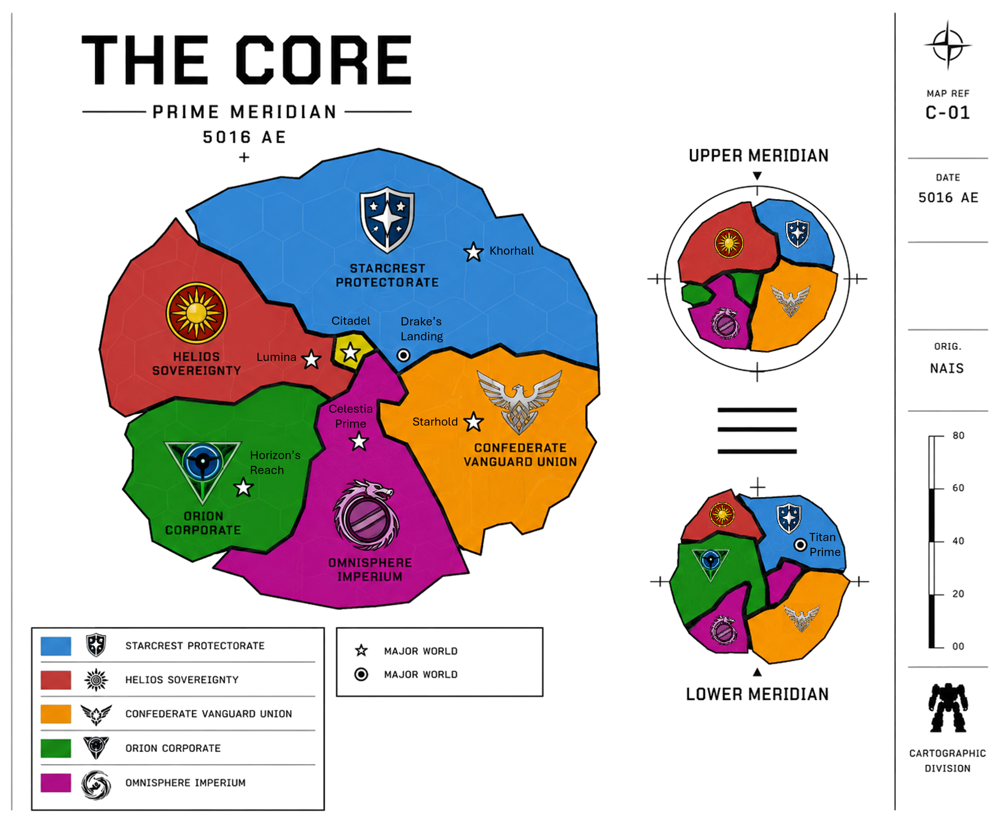

# The Core

> *“Civilization survives only so long as the Core endures.”*  
> — StarCom archival proverb

## :material-earth: Overview

|  |  |
|---|---|
| :material-bank: **Central Authority** | The Star Regency |
| :material-crown: **Current Star Regent** | Jacob Caledon |
| :material-family-tree: **Ruling House** | House Caledon |
| :material-map-marker: **Capital World** | Citadel |
| :material-account-group: **Major Powers** | The Five Great Houses |
| :material-star: **Current Era** | 5016 AE |
| :material-book-open-page-variant: **Words of House Caledon** | “Rule Above All.” |

The Core refers to the central region of known human civilization and the political, military, industrial, and cultural heart of interstellar society.

The region is composed of several dozen densely populated and highly developed worlds governed collectively through the authority of the [Star Regency](../factions/star-regent.md) and the alliance known as the Stellar Conclave.

Although commonly spoken of as a unified civilization, the Core is in practice a complex balance of competing powers, ancient traditions, military alliances, industrial interests, and political rivalries held together through diplomacy, mutual dependence, and the stabilizing authority of [House Caledon](../factions/star-regent.md).

While the Core remains the most prosperous and technologically advanced region of known space, competition between the Great Houses continues to shape nearly every aspect of interstellar life. Trade disputes, territorial disagreements, industrial rivalries, and political ambitions frequently spill into open conflict. As a result, [Mercenaries](../mercenaries/) and [Mechs](../mechs/) have become central institutions of Core society. The Great Houses rely upon vast military forces, independent mercenary companies, and powerful war mechs not only to defend against pirates, bandits, and frontier raiders, but also to wage proxy conflicts, conduct raids, and pursue their interests without risking full-scale interstellar war.

## Why the Core Matters

For most of human space, the Core is more than a region. It is the center of political authority, economic power, military strength, and cultural influence.

The Great Houses, Star Regency, StarCom, Mercenary Guild, and many of the most important institutions in modern civilization all trace their authority to the Core. Decisions made on its worlds often shape events thousands of light-years away.

To supporters, the Core represents humanity's greatest achievement since the Great Restoration.

To critics, it represents a wealthy collection of successor states living among the ruins of a greater civilization.

## The Great Houses

Five dominant powers comprise the political foundation of the modern Core:

| Great House | Ruling House | General Character |
|---|---|---|
| [Confederate Vanguard Union](../factions/confederate-vanguard-union/) | Hawkins | Militarized industrial state emphasizing strength, discipline, and collective sacrifice |
| [Helios Sovereignty](../factions/helios-sovereignty/) | Aerin & Payne | Wealthy centralized power focused on stability, order, and economic influence |
| [Omnisphere Imperium](../factions/omnisphere-imperium/) | Lytherius | Ancient aristocratic realm preserving many old traditions of the Core |
| [Starcrest Protectorate](../factions/starcrest-protectorate/) | Konnen | Harsh frontier power built around resilience, honor, and martial duty |
| [Orion Corporate](../factions/orion-corporate/) | Noddack | Technological and scientific authority focused on innovation and internal development |

Together these powers form the Stellar Conclave, the governing alliance of the Core Worlds.

Each maintains independent territory, militaries, economies, and political interests while recognizing the authority of the Star Regent and the necessity of preserving stability throughout the Core.

## The Star Regency

→ See: [The Star Regency](../factions/star-regent.md)

The Core is formally governed by the Star Regent from the capital world of Citadel.

The current Star Regent is Jacob Caledon of House Caledon, the ancient ruling line responsible for re-establishing civilization during the Great Restoration.

Though House Caledon controls comparatively little territory directly, its legitimacy and symbolic authority remain recognized throughout the Core Worlds.

The words of House Caledon are:

> *Rule Above All.*

Among supporters of the Regency, these words are understood to mean that civilization, order, and stability must supersede the ambitions of any individual faction or ruler.

Critics occasionally argue that the Regency has become increasingly ceremonial in modern centuries, though few openly question the importance of preserving unity among the Great Houses.

## StarCom

→ See: [StarCom](../factions/starcom.md)

No institution exerts greater infrastructural influence across the Core than StarCom.

Officially neutral and operating independently of the Great Houses, StarCom maintains the communications relays, navigational archives, hyperspace routing systems, merchant traffic networks, and deep-space observation infrastructure upon which modern civilization depends.

The organization emerged during the early years of the Great Restoration and has since become indispensable to interstellar society. Few governments trust one another completely, but all of them trust StarCom's networks because there is no practical alternative.

The organization emerged during the early years following the Great Restoration and has since become indispensable to interstellar civilization. Without StarCom, large-scale communication and coordinated governance across the Core would be impossible.

## Civilization and Society

The Core contains the largest concentration of population, industry, military infrastructure, and scientific development in known space. Compared to the frontier regions beyond the Core, living standards are generally higher and political institutions more stable. However, increasing tensions between the Great Houses, expanding frontier instability, piracy, economic rivalry, and political extremism continue to threaten the long-term stability of the region.

Despite frequent political tensions, most citizens experience the Core as a period of relative peace and prosperity. Interstellar trade is common, communications are reliable, and travel between major worlds is routine. While individual House cultures vary considerably, shared institutions such as the Star Regency, StarCom, the Mercenary Guild, and centuries of economic integration have produced a broadly recognizable Core identity.

## Warfare

Modern warfare throughout the Core is dominated by mechanized combat, mercenary operations, limited territorial conflicts, covert actions, proxy wars, and strategic competition between the Great Houses.

[Mechs](../technology/mechs/) form the backbone of nearly all modern ground combat forces. Meanwhile, [mercenary companies](../society/mercenaries/) — commonly referred to throughout civilized space as “Metal Mercs” — play a major role in frontier security, deniable military operations, and inter-house conflicts. Large-scale [space warfare](../military/space-warfare/) remains comparatively rare.

The technological and industrial capabilities required to sustain massive fleet warfare were partially lost during the Empire's collapse and the long dark age that followed. As a result, modern powers generally avoid direct fleet attrition whenever possible.

## History

→ See: [The Empire](history/the-empire.md) and [The Dark Age](history/dark-age.md)

Much of the Core's earliest history has been lost to time.

According to surviving records, the Core was once the heartland of [the Golden Empire](history/the-empire.md), a vast interstellar civilization that united thousands of worlds through trade, military power, administration, and shared institutions. Ruled by the Star Emperor and supported by hundreds of noble houses, the Empire governed a territory far larger than the modern Core and achieved levels of technological and industrial development that have never been fully recovered.

At its height, the Empire represented the largest and most powerful civilization in recorded human history.

Sometime around 4000 AE, the Empire collapsed during a catastrophic conflict associated with the mysterious Ophidian Supremacy. The exact nature of the Supremacy remains one of the greatest unanswered questions in human history. Traditional accounts describe the Ophidians as the force responsible for the destruction of the Empire and the subsequent occupation of much of the Core. However, surviving records from the era are fragmentary, contradictory, and often separated from the events they describe by centuries.

Very little direct evidence of the Supremacy has ever been discovered. Some historians believe the Ophidians were a rival interstellar civilization that invaded from beyond known space. Others argue they were merely one factor among many in a broader collapse caused by internal conflict, economic decline, or civil war. Some historians argue the Ophidian Supremacy became a historical metaphor for a broader collapse rather than a single identifiable enemy.

Whatever the truth, the Fall was followed by several centuries of chaos known as [The Dark Age](history/dark-age.md).

During this period, interstellar communications collapsed, trade networks disappeared, and much of the Core fragmented into isolated worlds and competing regional powers. Famine, piracy, warfare, and political instability became widespread. Entire worlds vanished from recorded history, while countless technologies, institutions, and historical records were lost. A handful of states endured the turmoil, most notably the Imperium, the Starcrest Protectorate, and the Orion Corporate, but much of the Core was consumed by centuries of decline and conflict.

The Dark Age eventually came to an end with the Great Restoration. According to accepted history, exiled remnants of the Empire returned from the Deep Fringe under the leadership of House Caledon and gradually re-established stability throughout the Core. In the centuries that followed, the modern Great Houses emerged, the Stellar Conclave was established, and interstellar civilization began to recover.

Most surviving historical records originate from the post-Restoration era. As a result, many details concerning the Empire, the Ophidian Supremacy, and the Dark Age remain subjects of ongoing scholarly debate.

## Geography and Regions

Although commonly depicted as a single political entity, the Core is geographically divided into several broad regions.

### The Prime Meridian

Most inhabited worlds of the Core lie within a dense galactic plane known as the **Prime Meridian**. This region contains the oldest trade routes, the greatest concentration of population, and the majority of the Core's industrial and military infrastructure.

The Prime Meridian is traditionally divided into two subregions:

#### Central Worlds

The Central Worlds occupy the heart of the Core and are generally considered the most prosperous, stable, and heavily defended systems in known space.

Notable Central Worlds include:

* [Citadel](../places/citadel/), seat of the Star Regency
* [Drake's Landing](../places/drakes-landing/), headquarters of the Mercenary Guild
* Lumina, capital of the Helios Sovereignty
* Celestia Prime, capital of the Omnisphere Imperium

The Central Worlds benefit from dense trade networks, strong StarCom infrastructure, rapid military response capabilities, and some of the highest standards of living in human space.

#### Outer Worlds

Beyond the Central Worlds lie the Outer Worlds.

These systems remain firmly within Core territory but are generally less developed, less densely populated, and more vulnerable to piracy, smuggling, and frontier unrest.

Notable Outer Worlds include:

* Khorhall, capital of the Starcrest Protectorate
* Horizon's Reach, capital of Orion Corporate
* Starhold, capital of the Confederate Vanguard Union

The distinction between Central and Outer Worlds is not political but practical. While life in the Outer Worlds remains far safer than in the Frontier, citizens often experience weaker governmental oversight, longer supply routes, and greater exposure to raids originating from the Fringe.

Worlds situated along the outermost edge of the Core are commonly referred to as **Border Worlds**. These systems serve as the first line of defense against piracy, bandit activity, and external threats emerging from the Fringe.

### The Upper Meridian

Above the Prime Meridian lies a secondary concentration of inhabited systems known as the **Upper Meridian**.

Smaller than the Prime Meridian and roughly comparable in radius to the Central Worlds, the Upper Meridian contains a mixture of industrial, agricultural, and commercial systems. While generally stable and prosperous, these worlds tend to resemble the Outer Worlds in both population density and security.

Though less politically influential than the Prime Meridian, the Upper Meridian remains an important contributor to the Core's economy and military manpower.

### The Lower Meridian

Below the Prime Meridian lies the **Lower Meridian**, a broad collection of systems somewhat larger than the Upper Meridian.

The Lower Meridian contains a mixture of industrial worlds, mining systems, military outposts, and independent commercial hubs. Conditions vary considerably between systems, though most are comparable to the Outer Worlds in development and security.

Among its most famous worlds is [Titan Prime](../places/titan-prime/), the renowned gladiator world whose arenas attract competitors and spectators from across human space.

### Neutral Worlds

A small number of worlds maintain special statuses recognized by all Great Houses regardless of their location.

Among the most prominent are Drake's Landing and Titan Prime. Their neutrality, economic importance, and strategic value have made them important gathering places for merchants, mercenaries, diplomats, and travelers throughout the Core.

Although the Great Houses periodically attempt to increase their influence over these worlds, centuries of custom and mutual interest have generally preserved their independence.

## Beyond the Core

→ See: [The Fringe](../society/fringe-worlds.md) and [The Frontier](../places/the-frontier.md)

Beyond the borders of the Core lie vast frontier regions containing isolated colonies, mining worlds, pirate territories, mercenary enclaves, independent settlements, and abandoned systems.

While formally connected to the Core through trade and StarCom infrastructure, many frontier regions operate with limited oversight from the Great Houses. Some maintain close economic ties with the Core, while others are effectively independent in all but name.

The Frontier remains a source of valuable resources, mercenary recruits, exploration opportunities, and occasional threats. Pirates, warlords, and independent powers are far more common beyond the Core than within it.

## The Myth of Civilization

Most citizens of the Core believe they live within the restored heart of human civilization.

This belief is not entirely unfounded. The Core is wealthy, technologically advanced, and militarily powerful. Trade routes are secure, governments are stable, and the Great Houses maintain the strongest known military forces in human space.

Yet many historians argue that the Core has not restored the Empire so much as inherited its ruins.

The Core governs only a fraction of the territory once controlled by Imperial authorities. Vast regions of human space remain poorly mapped, weakly governed, or entirely outside House influence.

To its citizens, the Core represents civilization.

To many historians, it represents civilization's most successful remnant.

## Demographics and Settlement

→ See also: [Demographics](demographics.md) and [Irregular Forces](irregular-forces.md)

Although the Core contains more than sixty billion inhabitants, most worlds remain surprisingly undeveloped outside major population centers.

A typical Core world may contain one or two enormous cities and a handful of smaller settlements, surrounded by vast regions of wilderness, agricultural land, mining territories, abandoned Empire-era infrastructure, and isolated communities.

This pattern dates back to both the Empire and the Dark Age. Many worlds possess infrastructure designed to support populations far larger than those that currently inhabit them, while others contain enormous abandoned districts whose original purpose has long been forgotten.

As a result, even heavily populated worlds often contain enormous regions that remain lightly settled, poorly surveyed, or rarely visited.

These vast and often sparsely monitored regions have also contributed to the persistence of bandits, pirates, smugglers, separatists, and other irregular forces throughout the Core. While the Great Houses maintain powerful militaries and extensive security networks, the sheer scale of inhabited space makes complete oversight impossible. Many remote regions, abandoned facilities, and forgotten settlements remain beyond the routine reach of government authorities, providing opportunities for both legitimate communities and those operating outside the law.