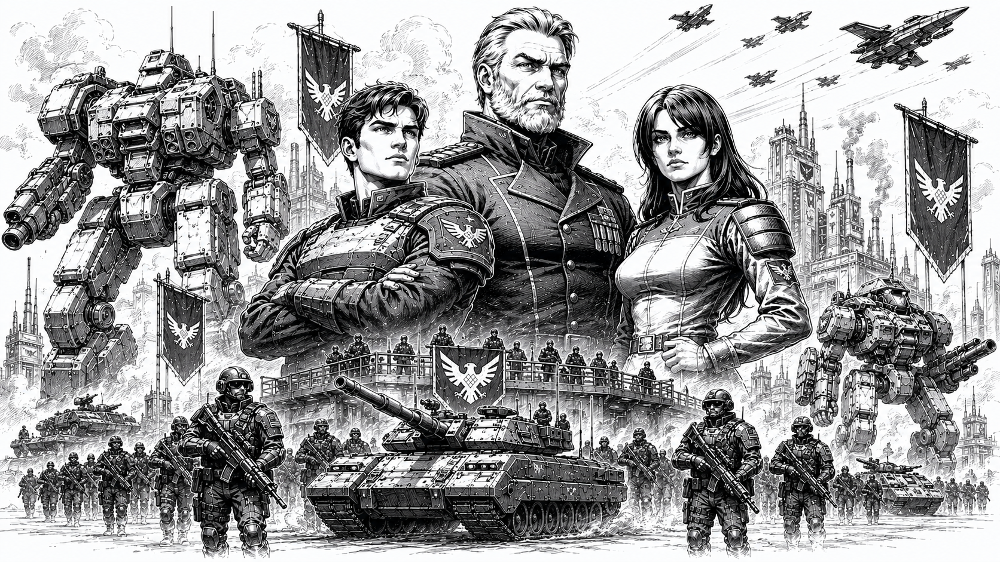

# Confederate Vanguard Union

> *“We are not soldiers. We are conquerors.”*  
> — Ryder Hawkins

*State propaganda illustration depicting Victor Hawkins (center) and his children, Maximus (left) and Ryder (right) Hawkins, standing before the military strength of the Confederate Vanguard Union. Images of this kind are commonly displayed throughout Confederate space to symbolize unity, strength, and reverence for House Hawkins.*

## :material-hammer-wrench: Overview

|  |  |
|---|---|
| :material-bank: **Government Type** | Military State |
| :material-map-marker: **Capital** | [Starhold](../worlds/union-worlds.md/#starhold) |
| :material-account-group: **Leadership** | Confederate Military Council |
| :material-factory: **Primary Strength** | Industry and Mechanized Warfare |
| :material-tank: **Military Specialty** | Heavy Mech Assault |
| :material-book-open-page-variant: **National Motto** | “Forged From Victory.” |

The Confederate Vanguard Union, commonly referred to simply as *the Union*, is one of the five dominant powers of the [Core Worlds](../core/).

The Union is widely regarded as the most militarized state in the Core and possesses the largest standing mech force among the [Great Houses](./). Its society is heavily shaped by military service, industrial labor, and state-directed nationalism.

Union culture emphasizes strength, sacrifice, discipline, and collective identity above individual ambition. Service to the state is regarded not merely as duty, but as the foundation of civilization itself.

While critics often describe the Union as authoritarian and expansionist, supporters argue that the Confederates possess the resolve and industrial capacity necessary to preserve humanity against the growing instability of the frontier.

## History

The origins of the Confederate Vanguard Union trace back to the collapse of [the Old Empire](../core/old-empire.md) and the wars that followed.

During the chaos of [the Collapse](../core/history/the-collapse.md) and the occupation of the Core by the Ophidian Supremacy, remnants of the Empire’s Vanguard military forces fled the Core. For several generations the survivors lived in exile before eventually being led back to reclaim the Core in [the [Great Restoration](../core/history/restoration.md)](../core/history/restoration.md).

Following the restoration and the destruction of the Ophidian Supremacy, the Star Regent was left with large portions of seized, ungoverned territories and granted statehood to his vanguard forces for their valiant actions during the war. The Confederate Vanguard Union was thus established to hold dominion over these new territories.

As a result, the Union continues to view itself not merely as another Core state, but as the rightful heir to the military traditions of the old Empire.

## Starhold

Starhold is the capital world of the Confederate Vanguard Union and one of the most heavily industrialized planets in the Core.

The planet is dominated by:

- military foundries
- mech assembly complexes
- orbital shipyards
- industrial arcologies
- defense manufacturing zones

Much of Starhold is dedicated to sustaining the Union’s military infrastructure.

The world is also home to the Honor Guard, one of the oldest surviving military organizations in the Core.

## Government

The Union is governed through a centralized military state structure overseen by the Confederate Military Council.

Military leadership exerts enormous influence over political, industrial, and social policy.

Citizenship within the Union is closely tied to service, and military veterans occupy many positions of authority throughout Confederate society.

The Union justifies this system as necessary to preserve unity, discipline, and preparedness in an increasingly dangerous galaxy.

Opponents frequently criticize the Confederates for suppressing dissent and prioritizing military expansion over civilian freedoms.

Union officials generally dismiss such criticism as political rhetoric originating from weaker states unwilling to make difficult sacrifices for long-term survival.

## Society and Culture

Confederate society is built around:
- military service
- industrial productivity
- sacrifice
- loyalty to the state
- collective identity

Public life within the Union heavily glorifies:
- soldiers
- industrial workers
- mech pilots
- military heroes
- historical victories

State propaganda frequently portrays the Union as the shield protecting humanity from chaos, weakness, and fragmentation.

The phrase:

> *Forged From Victory.*

is commonly displayed throughout Confederate territory and reflects the Union belief that strength and unity are born through struggle.

## Military

The Confederate Vanguard Union possesses the largest mech force in the Core Worlds.

Confederate doctrine emphasizes:
- overwhelming mechanized assaults
- industrial warfare
- sustained battlefield pressure
- heavy armor
- direct engagement
- logistical endurance

Union mechs are widely known for:
- durability
- battlefield reliability
- ease of repair
- high heat tolerance
- mass-production efficiency

Confederate commanders generally favor decisive force over subtle maneuvering.

The Union also maintains extensive armored divisions, artillery forces, orbital support fleets, and mechanized infantry formations.

## The Honor Guard

The Honor Guard is among the most prestigious military organizations within the Union.

Originally formed from surviving Vanguard veterans during the wars against the Ophidian Supremacy, the Honor Guard has become both a ceremonial and elite combat formation.

Membership within the Guard is considered one of the highest honors attainable in Confederate society.

Throughout the Core, the Honor Guard possesses a reputation for:
- discipline
- battlefield effectiveness
- loyalty
- unwavering resolve

## Frontier Policy

The Union maintains an aggressive presence throughout frontier regions bordering the Core.

Confederate leadership argues that instability beyond the Core inevitably threatens civilization itself and therefore justifies proactive military intervention.

As a result, Confederate forces are frequently involved in:
- anti-piracy campaigns
- frontier security operations
- industrial protection contracts
- territorial disputes
- [mercenary](../mercenaries/) suppression actions

Rival powers often accuse the Union of using “security operations” to expand its territorial influence.

The Confederates reject these accusations and maintain that they are simply willing to confront threats other states prefer to ignore.

## Relations with Other Powers

The Union maintains especially tense relations with the Helios Sovereignty, whose aristocratic culture and economic dominance are often criticized within Confederate propaganda.

Relations with the Starcrest Protectorate fluctuate between cooperation and rivalry depending upon frontier conditions.

The Confederates remain wary of Orion Corporate influence, particularly regarding advanced technology and private industrial monopolies.

Despite political tensions, the Union remains a formal member of the Stellar Conclave and recognizes the authority of the Star Regent.

## Reputation

Throughout the Core, the Confederate Vanguard Union is viewed as:
- disciplined
- militaristic
- industrial
- resilient
- uncompromising

Supporters regard the Confederates as the strongest defenders of humanity remaining in civilized space.

Critics view them as increasingly authoritarian and dangerously expansionist.

Even among rivals, however, Confederate military strength is rarely underestimated.

## Modern Outlook

As tensions rise throughout the Core and instability spreads across frontier space, the Confederate Vanguard Union continues to expand its military readiness and industrial production.

Confederate leadership maintains that another great conflict between the powers of the Core is inevitable.

Whether the Union ultimately becomes humanity’s shield or the architect of another devastating interstellar war remains one of the defining political questions of the modern era.