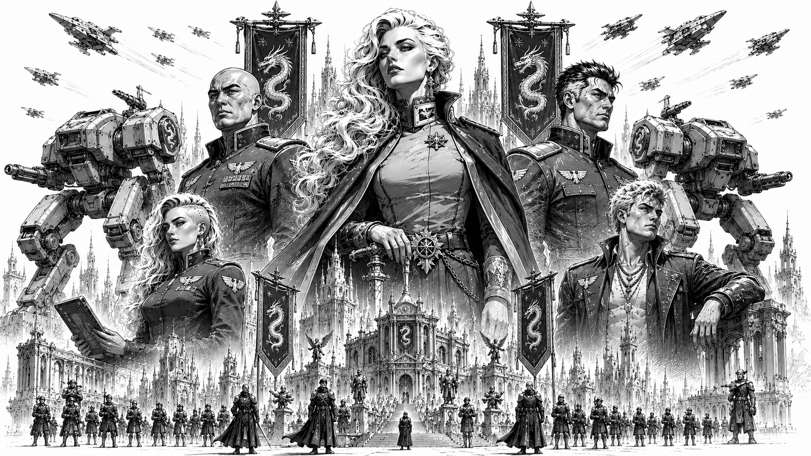

# Omnisphere Imperium

> *“When the stars went dark, the Imperium carried the flame of civilization.”*  
> — Imperial remembrance inscription

*State propaganda illustration depicting Imperator Jada Lytherius (center) flanked by her children: Takarion Lytherius (left), Sylara Lytherius (lower left), Valtorian Lytherius (right), and Rythor Lytherius (lower right), standing before the military and cultural power of the Omnisphere Imperium. Towering war machines, dragon banners, and the spires of the Imperial Core rise behind the ruling bloodline of House Lytherius.*

## :material-dragon: Overview

|  |  |
|---|---|
| :material-bank: **Government Type** | Imperial aristocracy |
| :material-crown: **Ruling House** | House Lytherius |
| :material-account: **Current Ruler** | Imperator Jada Lytherius |
| :material-map-marker: **Capital World** | Celestia Prime |
| :material-account-group: **Population** | 12.3 billion |
| :material-robot-industrial: **Military Strength** | 220,000 mechs |
| :material-heart: **Friendly Ties** | Starcrest Protectorate |
| :material-sword-cross: **Hostilities** | Orion Corporate; Confederate Vanguard Union |
| :material-book-open-page-variant: **Words** | “Fierce Beauty.” |

The Omnisphere Imperium, often called *the Imperium* or *the Dragon Riders*, is one of the five [Great Houses](./) of the Core and the oldest surviving state in known human civilization.

The Imperium is widely recognized as the only surviving power from the age of the ancient Empire. Its roots extend even further back, to the centuries before the [Empire](../core/history/the-empire.md) united the Core, when the region that would become the Imperium was divided among smaller states known for metallurgy, engineering, and fierce competition over rare minerals and energy sources.

In the modern Core, the Imperium is known for honor, duty, artistic excellence, military discipline, and a cultural philosophy that joins beauty with strength. Its words, “Fierce Beauty,” reflect this union of refinement and martial power.

The Imperium also maintains a deep symbolic association with fire. Fire represents civilization, continuity, memory, life, and the will to endure. Imperial tradition often describes House Lytherius and the Imperium as the keepers of the flame that survived the Collapse and carried civilization through the dark age.

## History and Origins

The history of the Imperium begins centuries before the rise of the ancient Empire.

Before its formation, the region that would become the Imperial heartland was fragmented among multiple smaller powers. These states possessed distinct cultural practices, but many shared a focus on metallurgy, engineering, and resource extraction. Frequent conflicts over rare minerals and energy sources shaped the early military and industrial traditions of the region.

The rise of House Lytherius is traditionally tied to Vyrexia Lyther, a brilliant and ambitious leader remembered as both a skilled warrior and a tactical visionary.

The defining moment in early Imperial history was the development of the first war mech. This breakthrough granted House Lytherius a sudden and overwhelming battlefield advantage, allowing rapid expansion across surrounding territories and laying the foundation for the Omnisphere Imperium.

The Imperium’s early conquests funded both military and artistic growth. Wealth from conquered territories supported the industrial base necessary to maintain mech armies, while also patronizing artists, poets, engineers, philosophers, and scholars.

This fusion of martial supremacy and artistic achievement became one of the defining features of House Lytherius culture.

### Matriarchal Tradition

The Imperium is one of the few major powers of the Core where women traditionally occupy the highest positions of authority. This custom traces its origins to its first Imperator, Vyrexia, whose descendants established many of the noble traditions that continue to shape Imperial society.

To the Lytherians, lineage is sacred. Noble houses maintain genealogical records stretching back centuries, and legitimacy is often derived from bloodline as much as law. Throughout Imperial history, succession disputes have toppled dynasties, fractured provinces, and ignited wars. As a result, the Imperium developed an intense cultural aversion to uncertainty in matters of inheritance.

A common Lytherian saying holds that *"A father is claimed; a mother is known."* While modern science is fully capable of establishing ancestry, the tradition predates such technologies by centuries and remains deeply embedded in Imperial culture. Because maternal lineage is viewed as unquestionable, dynastic authority is often traced through women, and daughters are frequently favored as heirs. To lose track of a legitimate heir—or worse, to place the wrong heir upon a throne—is considered one of the gravest failures imaginable in Lytherian society. This tradition extends even to the Imperator herself. Throughout history, Imperators have commonly taken male consorts for the purpose of producing heirs, but those consorts are rarely considered part of the ruling dynasty. To the Lytherians, the children of an Imperator belong not to a family, but to the Imperium itself. From an early age they are educated, groomed, and prepared for service to the state, with their loyalty directed first toward the reigning Imperator and the Imperium rather than toward any paternal lineage. Fathers are generally expected to play little role in the upbringing of Imperial heirs, a custom that reinforces the belief that dynastic continuity flows through the maternal line alone. 

This does not prevent men from inheriting titles or exercising power. Male nobles regularly serve as rulers, generals, governors, and statesmen. However, among the oldest Lytherian houses, women are often regarded as the safest custodians of dynastic continuity. The result is a society where female rulers are common, expected, and widely respected, though not universally required.

## The Old Empire and the Collapse

At its height, the early Imperium commanded vast territories and possessed unmatched technological superiority through its mech armies.

Over time, however, the scale of its territory became a vulnerability. Internal rebellions, political betrayal, economic strain, and external pressures weakened Imperial dominance.

Eventually, the broader ancient Empire emerged, and the reduced but still powerful Omnisphere Imperium became a member state within that larger order.

During the Collapse and the dark age that followed, the Imperium endured where nearly every other major power fell.

Imperial records claim the Imperium resisted the forces associated with the Ophidian Supremacy and preserved its core territories through fortified defense, discipline, and strict internal cohesion.

Although the Imperium lost worlds during the era, its government, ruling house, and central culture survived intact.

This continuity remains central to Imperial identity.

## Darker History

The modern Imperium often emphasizes honor, art, beauty, and stability, but StarCom historical records also preserve accounts of a harsher early Imperial past.

Early Imperial expansion was frequently brutal.

Defeated forces were often given grim ultimatums: swear loyalty or face execution. In several accounts, defiant captives were annihilated immediately using mech weaponry as a demonstration of Imperial power.

The early Imperium also relied upon slave labor to accelerate industrialization across conquered worlds. Dissenters, rebels, and military prisoners were often publicly executed to suppress resistance.

Whole populations were relocated into strategic settlements, local cultures were disrupted, and Imperial dominance was displayed through grand military parades featuring war trophies and captives.

Blood sports involving prisoners also formed part of early Imperial spectacle, serving both as entertainment and as a reminder of state power.

The modern Imperium has formally abandoned the most brutal of these practices. However, this darker history is often softened, romanticized, or minimized within later Imperial accounts.

## Celestia Prime

Many of the Imperium's greatest monuments, museums, military academies, temples, and historical archives are located on Celestia Prime. To Imperial citizens, the world is more than a capital—it is a living symbol of continuity stretching back thousands of years.

The world escaped much of the devastation that consumed the Core during the Collapse, and many structures standing today predate the formation of several modern Great Houses.

## House Lytherius

The Omnisphere Imperium is ruled by House Lytherius, the oldest continuously governing dynasty in the Core and one of the oldest surviving political institutions in known human history. For more than two millennia, the house has guided the Imperium through periods of expansion, decline, invasion, and renewal, becoming inseparable from the state it governs.

### Imperator Jada Lytherius

The current ruler of the Imperium is **Imperator Jada Lytherius**, a leader widely respected for her wisdom, patience, and long-term vision. Stoic and composed by nature, Jada rarely acts impulsively, preferring careful deliberation and strategic planning over dramatic displays of authority. While some rivals mistake her measured demeanor for indecision, few who know her well make that mistake twice.

Under Jada's leadership, the Imperium has pursued a cautious and deliberate foreign policy, avoiding reckless conflicts while maintaining a reputation for responding to threats with overwhelming force when necessary. Her reign has emphasized stability, continuity, and the preservation of Imperial institutions.

Like many Imperators before her, Jada never married. Instead, she took consorts in accordance with Lytherian tradition and bore four children with prominent regional leaders from within the Imperium. As Imperial custom dictates, her children were raised primarily within the institutions of House Lytherius and the state itself. To the Lytherians, heirs of the Imperator belong first to the Imperium and only secondarily to any individual family.

### The Heirs of the Imperium

Jada's eldest sons, **Takarion Lytherius** and **Valtorian Lytherius**, rank among the Imperium's most respected military commanders. Both embody many of the traditional Lytherian virtues: discipline, patience, strategic thinking, and unwavering devotion to duty. Though similar in temperament, they possess distinct command styles and have earned reputations as formidable battlefield leaders.

The designated heir to the Imperium is **Sylara Lytherius**, whose talents lie not in warfare but diplomacy. Intelligent, thoughtful, and deeply idealistic, Sylara has become known throughout the Core for her efforts to resolve conflicts through negotiation rather than force. Her views often place her at odds with more traditional elements of the Imperial establishment, including members of her own family, who worry that her faith in diplomacy may prove inadequate in an increasingly dangerous age. Supporters, however, see her as the future of a changing Imperium.

The youngest child, **Rythor Lytherius**, stands apart from his siblings. A gifted warrior and talented mech pilot, Rythor possesses little interest in governance or court politics. He thrives on competition, tournaments, and the thrill of battle, often treating combat as a challenge to be mastered rather than a solemn duty. Though frequently frustrated by his responsibilities, he remains one of the most naturally gifted members of his generation and is widely admired by younger warriors throughout the Imperium.

Together, the children of Jada Lytherius represent the competing visions that may one day shape the future of the Imperium: military strength, diplomatic reform, tradition, ambition, and the enduring legacy of House Lytherius itself.

## Society and Culture

Imperial culture is built around the pursuit of excellence. Honor, duty, discipline, artistry, scholarship, and martial skill are not viewed as separate virtues, but as different expressions of the same ideal: the continual refinement of oneself in service to a greater purpose.

Unlike many societies of the Core, the Imperium does not draw a sharp distinction between warriors, artists, scholars, or statesmen. The ideal Imperial citizen strives to cultivate multiple disciplines throughout their life. A military commander may also be a poet. An engineer may study philosophy. An artist may be expected to understand strategy and history. To the Imperium, true mastery requires both strength and refinement.

This philosophy is reflected throughout Imperial society. Public spaces are designed not only to be functional, but beautiful. Military academies teach history and literature alongside tactics. Noble families sponsor artists, musicians, engineers, and scholars with the same enthusiasm they support military officers. Across the Imperium, there exists a widespread belief that anything worth doing is worth doing exceptionally well.

Honor and duty remain central pillars of Imperial identity. Citizens are taught from an early age that individual ambition must ultimately serve the stability and prosperity of the Imperium. Service to family, community, and state is regarded as a sacred obligation, and those who sacrifice personal gain for the greater good are often celebrated as role models.

To outsiders, Imperial culture can appear proud, rigid, and even elitist. Imperial citizens generally regard such criticism as the inevitable consequence of maintaining high standards. In the Imperial view, civilization is not preserved through comfort or convenience, but through discipline, excellence, and the continual pursuit of perfection.

## The Eternal Flame

Fire occupies a central place within Imperial culture, philosophy, and symbolism.

To the Lytherians, flame represents far more than heat or light. It symbolizes civilization itself: knowledge preserved across generations, memory carried through history, sacrifice made for future descendants, and the enduring will of humanity to survive.

This symbolism is rooted in the Imperium's understanding of its own history. Imperial tradition teaches that while much of civilization collapsed during the Dark Age, the Imperium preserved a fragment of the old world and carried that flame forward until order could be restored. Whether interpreted literally or metaphorically, the image remains one of the most powerful symbols in Imperial identity.

Eternal flames burn within military academies, government buildings, memorials, and temples throughout the Imperium. State ceremonies frequently involve torch processions, ceremonial braziers, and fire-lit vigils honoring both historical heroes and fallen soldiers.

The dragon imagery associated with House Lytherius is closely connected to this philosophy. In Imperial thought, dragons are not merely creatures of destruction. They are guardians of civilization's flame, protectors of knowledge, and symbols of the immense responsibility that accompanies power.

To outsiders, these traditions can appear theatrical or romanticized. To the Lytherians, they serve as a constant reminder that civilization survives only so long as someone is willing to tend the fire.

## Politics and Diplomacy

The Imperium employs a deliberate and cautious political approach.

Its leaders prefer measured responses to threats and challenges rather than hasty escalation. When provoked, however, the Imperium responds with calculated resolve and formidable force.

The Imperium maintains friendly ties with the Starcrest Protectorate, as both powers share cultural foundations rooted in honor and duty.

Relations with the Orion Corporate and the Confederate Vanguard Union are strained.

Orion Corporate often views the Imperium as traditional and outdated, too bound to ritual and inherited customs.

The Union views the Imperium as a serious military contender, particularly because Imperial military strength challenges the Union’s claim to military supremacy.

Relations with the Helios Sovereignty are generally reasonable, largely because geography limits direct conflict between them rather than because of deep cultural similarity.

## Economy

The Imperium possesses one of the oldest industrial economies in human space. Many of its economic foundations can be traced back centuries before the rise of the ancient Empire itself.

Mining, metallurgy, advanced manufacturing, military production, and artistic craftsmanship remain central pillars of Imperial industry. While the Sovereignty dominates commerce and finance, and Orion Corporate leads in technological innovation, the Imperium is renowned for the quality of its production rather than the scale of its output.

Imperial artisans, armorers, engineers, and manufacturers often spend years refining designs that other states would mass-produce. This pursuit of excellence increases costs but has earned Imperial goods a reputation for exceptional quality throughout the Core.

To the Imperium, beauty and utility are not opposing ideals. A machine should function flawlessly. It should also be worthy of admiration.

## Weapons and Doctrine

The Imperium's military philosophy reflects the same pursuit of excellence that shapes its culture.

Rather than emphasizing overwhelming numbers or industrial efficiency, Imperial doctrine focuses on precision, mobility, initiative, and mastery. Commanders are encouraged to view warfare as both a science and an art, rewarding creativity, discipline, and adaptability over rigid adherence to doctrine.

This philosophy is reflected in the distinctive appearance and performance of Imperial war machines. Lytherian mechs favor sleek, serpentine designs that sacrifice some armor protection in exchange for exceptional speed and agility. Their machines are often among the fastest in their weight class, allowing Imperial forces to dictate the terms of engagement and exploit weaknesses before an opponent can respond.

The Imperium's signature technological achievement is the advanced arcanite engine, a propulsion system that provides superior mobility without sacrificing battlefield endurance. Combined with generations of refinement in neural interfaces, metallurgy, and weapons engineering, these systems have produced some of the most feared combat machines in the Core.

Imperial forces rarely seek prolonged battles of attrition. Instead, they prefer rapid strikes, precision ambushes, concentrated opening volleys, and carefully timed withdrawals. Victory is achieved not by overpowering an opponent directly, but by controlling the flow of battle itself.

This doctrine is reinforced by the Imperium's distinctive weapon systems. The most famous of these is the Blaster, a burst-fire energy weapon that stores multiple charges before releasing them in a devastating opening volley. While blasters are less efficient than conventional lasers during extended engagements, they excel at delivering overwhelming damage during the first moments of combat. Imperial commanders frequently use this advantage to strike hard, disengage, and reposition before an enemy can effectively respond.

Imperial forces also make extensive use of heat warfare. Scorchers, High Energy Cannons, and other thermal weapons are employed not merely to damage opponents, but to overwhelm cooling systems, restrict mobility, and gradually reduce battlefield effectiveness. Once an enemy begins struggling with heat management, Imperial units exploit the resulting weaknesses through superior speed and maneuverability.

Throughout the Core, Imperial mech pilots are often known as the **Dragon Riders**. Originally coined by outsiders, the nickname refers both to the serpentine appearance of Imperial mechs and to their style of warfare: swift, elegant, disciplined, and devastating when allowed to strike on their own terms.

### The Dragon Riders

Imperial mech pilots are often referred to throughout the Core as the Dragon Riders. The name originates from the distinctive serpentine designs favored by Imperial engineers, many of which resemble the dragons that occupy a central place within Imperial mythology and symbolism.

Over time, the nickname became synonymous with the Imperium's style of warfare itself: swift, elegant, devastating, and difficult to pin down. Though originally coined by outsiders, many Imperial warriors have proudly embraced the title.

## Mercenary Relations

Mercenaries often find the Imperium difficult to work for at first.

The Imperium does not believe in rewards without trust. New [mercenary](../mercenaries/) companies may struggle financially while attempting to prove their reliability and earn Imperial confidence.

However, those who gain the trust and respect of the Imperium often find it to be one of the most generous employers in the Core.

As a result, mercenaries who successfully establish themselves with the Imperium are often fiercely loyal to its cause.

## Public Reputation

The Omnisphere Imperium inspires stronger opinions than almost any other power in the Core.

To its supporters, the Imperium represents the highest ideals of civilization. Its citizens point to centuries of cultural achievement, military excellence, scientific innovation, and political stability as evidence that the Lytherian model has endured where countless others have failed. Many view the Imperium as the closest surviving connection to the greatness of the ancient Empire.

Critics see something different.

Outside observers often accuse the Imperium of arrogance, elitism, and excessive reverence for its own traditions. Imperial nobles are frequently portrayed as believing themselves intellectually, culturally, and morally superior to the rest of the Core. While Imperials generally reject such accusations, their confidence rarely does much to discourage them.

Relations with other powers are similarly complex. Union citizens often view the Imperium as proud and detached. Protectorate citizens tend to respect its military accomplishments while questioning its aristocratic culture. Corporate analysts admire Imperial engineering but criticize what they see as a reluctance to embrace disruptive innovation. Within the Sovereignty, opinions range from admiration for Imperial refinement to frustration with its traditionalism.

Even among its critics, however, there remains a certain degree of respect.

The Imperium's military academies are among the most prestigious in human space. Its engineers continue to produce some of the finest war machines in the Core. Its artists, scholars, and philosophers exert influence far beyond its borders.

As a result, many citizens hold two contradictory views simultaneously: they may dislike the Imperium, but they rarely dismiss it.

As one popular saying puts it:

> *"Everyone complains about the Imperium. Nobody ignores it."*

## Modern Outlook

The Omnisphere Imperium remains one of the most stable and respected powers in the Core.

It is no longer the dominant civilization it once was, yet it has endured longer than any other known state.

As tensions rise between the Great Houses, the Imperium continues to present itself as the keeper of civilization’s flame: ancient, disciplined, beautiful, and prepared to defend what remains of the Core.