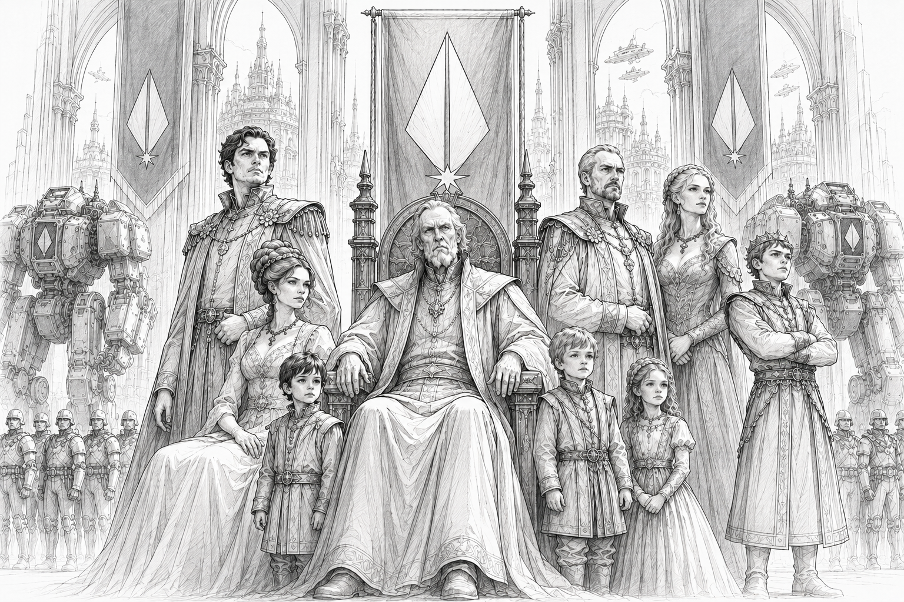

# The Star Regency

> *“Rule above all.”*  
> —  Words of House Caledon

*House Caledon, the ruling lineage of the Stellar Conclave upon [Citadel](../places/citadel.md). Seated upon the Throne of the Core is the Star Regent Jacob Caledon, flanked by his heir apparent and eldest son to the left alongside the heir’s wife and children. To the Regent’s right stands his younger brother and his brother's wife, beside his own son. Honor Guard troops and ceremonial war mechs stand watch within the Hall of Ascension beneath the banners of the Conclave.*

## :material-shield-crown: Overview

|  |  |
|---|---|
| :material-bank: **Government Type** | Supranational Regency |
| :material-account: **Current Star Regent** | Jacob Caledon |
| :material-family-tree: **Ruling Dynasty** | House Caledon |
| :material-map-marker: **Seat of Power** | Citadel |
| :material-account-group: **Governing Alliance** | The Stellar Conclave |
| :material-book-open-page-variant: **Words of House Caledon** | “Rule Above All.” |

The Star Regency is the central governing authority of the [Core Worlds](../core/) and the political institution responsible for maintaining unity among the [Great Houses](./).

Ruled by House Caledon from the capital world of [Citadel](../places/citadel.md), the Regency serves as both the symbolic continuation of the ancient Empire and the stabilizing force holding modern interstellar civilization together.

Though the Great Houses maintain independent governments, militaries, territories, and political ambitions, all formally recognize the authority of the Star Regent and the legitimacy of the Regency.

In practice, the Regency functions less as a traditional empire and more as a system of managed balance between rival powers.

## House Caledon

House Caledon traces its lineage to the final years of the [Empire](../core/history/the-empire.md).

According to [Restoration-era](../core/history/restoration.md) historical records, the last Emperor fell defending the evacuation of the Empire’s surviving military forces during the [Fall](../core/history/the-empire.md#the-fall). The precise details remain uncertain, though most surviving accounts describe a final defensive action carried out against the forces associated with the Ophidian Supremacy.

During the evacuation and subsequent exile beyond known Core space, leadership of the surviving fleet is believed to have passed to the ancestors of House Caledon under the title of Star Regent.

How long the exiled fleet remained beyond the Core remains unclear.

Most historians believe the exile lasted at least one generation, though some traditions claim it endured far longer.

Centuries later, House Caledon returned to the Core alongside the surviving Vanguard forces during the [Great Restoration](../core/history/restoration.md).

Following the reclamation of the Core Worlds, House Caledon established the modern Regency from Citadel and has ruled continuously ever since.

## Citadel

Citadel serves as the capital world of the Core and the seat of House Caledon.

The planet is regarded as politically neutral territory under direct Regency authority and functions as:
- the center of Conclave governance
- the residence of the Star Regent
- the location of major diplomatic assemblies
- the administrative heart of the Core

Citadel is among the most heavily defended worlds in known space.

Much of its infrastructure dates back to the earliest years following the Great Restoration, though portions of the world are believed to contain structures significantly older than the modern era.

## The Star Regent

The Star Regent serves as the supreme political authority of the Core Worlds.

Although the office does not directly govern the territories of the Great Houses, the Regent possesses extensive powers involving:
- inter-house diplomacy
- treaty enforcement
- Conclave arbitration
- emergency coordination
- military oversight
- preservation of interstellar law

The current Star Regent is Jacob Caledon.

Among both allies and rivals, Jacob is generally regarded as cautious, disciplined, and deeply committed to preserving stability throughout the Core.

Advanced age and declining health have increasingly shifted political attention toward the question of succession within House Caledon.

## The Stellar Conclave

The Stellar Conclave is the alliance of the five Great Houses under Regency authority.

The member powers are:
- the Confederate Vanguard Union
- the Helios Sovereignty
- the Omnisphere Imperium
- the Starcrest Protectorate
- Orion Corporate

Each Great House maintains independent:
- militaries
- territorial governments
- industrial economies
- political systems

The Conclave exists primarily to:
- prevent open war between the Houses
- preserve trade and stability
- coordinate large-scale policy
- maintain the unity established during the Great Restoration

Political tensions between the Houses remain constant, however.

Competition over:
- territory
- influence
- trade
- technology
- military prestige
- frontier operations

continues to shape much of modern Core politics.

## The Voice of the Regent

Among the most prestigious political offices in the Core is the position known as the Voice of the Regent.

The Voice functions as the chief political administrator and primary executive representative of the Regency, overseeing much of the day-to-day governance of the Core Worlds.

Historically, members of Houses Aerin and Payne of the Helios Sovereignty have frequently served in this role due to their administrative and economic influence during the reconstruction of the Core following the Great Restoration.

In practice, the Voice often functions as:
- chief diplomat
- political coordinator
- strategic advisor
- administrator of Conclave affairs

while the Star Regent serves as the symbolic and stabilizing center of the Core itself.

## The Peace of the Core

The Regency officially forbids open warfare between the Great Houses.

In practice, maintaining peace across the Core remains extraordinarily difficult.

Proxy conflicts, covert operations, economic warfare, political sabotage, and mercenary engagements occur regularly throughout frontier regions and contested territories.

It is widely understood throughout the Core that the Great Houses frequently employ mercenary forces to advance political interests while avoiding direct confrontation.

Although the Regency officially condemns such practices, enforcement remains inconsistent.

Many political observers believe House Caledon tolerates limited indirect conflict because the alternative — open war between the Great Houses — would threaten the stability of civilization itself.

As a result, the Regency’s true role is often described not as preventing conflict entirely, but containing it within survivable limits.

## Relationship with StarCom

The Regency maintains extremely close ties with StarCom.

StarCom infrastructure enables:
- interstellar governance
- communications
- navigational coordination
- diplomatic operations
- strategic intelligence gathering

Without StarCom support, the Regency could not effectively maintain authority across the Core Worlds.

Despite this relationship, StarCom officially remains politically neutral and institutionally independent from the Regency itself.

## Public Perception

Throughout the Core, perceptions of the Regency vary significantly.

Supporters view House Caledon as the final stabilizing force preventing humanity from descending once again into collapse and fragmentation.

Critics occasionally argue that the Regency has become overly bureaucratic, politically cautious, or incapable of adapting to growing instability across the frontier.

Even among critics, however, few openly advocate for the dissolution of the Regency itself.

The memory of the Collapse and the dark age that followed remains deeply embedded within Core political culture.

## Modern Outlook

As tensions between the [Great Houses](./) continue to intensify, the authority of the Regency faces increasing strain.

Frontier instability, growing militarization, economic rivalry, and political fragmentation have all placed new pressure upon the institutions established during the Great Restoration.

Whether House Caledon can continue preserving unity among the Great Houses may ultimately determine the future of civilization throughout the Core.