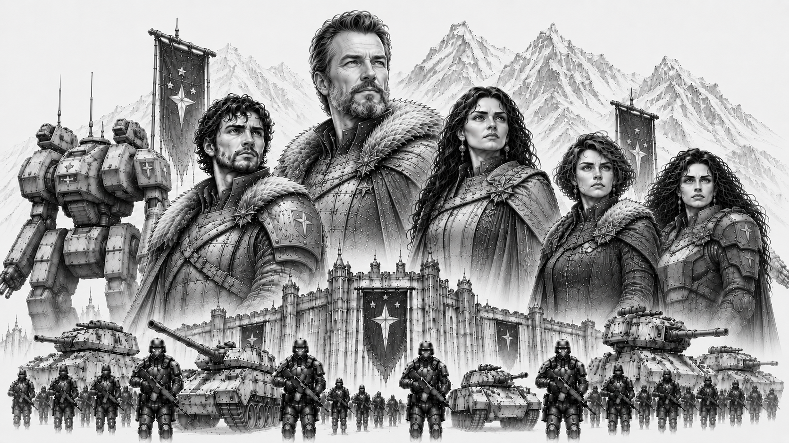

# Starcrest Protectorate

> *“We stand where others would flee.”*  
> — Riker Konnen

*Herzog Riker Konnen and Lady Konnen (center) standing at the center of House Konnen, rulers of the Starcrest Protectorate, surrounded by their bloodline and heirs. Riker's son and heir Korvan Konnen (left), and daughters Lyra and Selene Konnen (far right), stand with the armored ranks of the Storm Guards and the colossal war machines of the Protectorate looming behind them beneath the frozen peaks and fortress-palaces of Khorhall.*

## :material-shield-star: Overview

|  |  |
|---|---|
| :material-bank: **Government Type** | Military Protectorate |
| :material-map-marker: **Capital World** | Khorhall |
| :material-account-group: **Population** | 9.1 billion |
| :material-snowflake: **Environmental Character** | Harsh frontier worlds |
| :material-shield-sword: **Military Specialty** | Defensive Warfare and Heavy Combat |
| :material-handshake: **Strongest Alliance** | Omnisphere Imperium |
| :material-book-open-page-variant: **Words** | “Smoke and Steel.” |

The Starcrest Protectorate is one of the five Great Houses of the Core and one of its most respected military powers. Ruled by House Konnen from the fortress world of Khorhall, the Protectorate occupies nearly half of all Core space despite possessing one of the smallest populations among the Great Houses.

Born from the surviving frontier defense forces of a civilization destroyed during the Collapse, the Protectorate built its identity around endurance, sacrifice, and the belief that civilization survives only because someone is willing to defend it. While other powers measure success through wealth, influence, or conquest, the Protectorate places its faith in discipline, duty, and hard work.

The Protectorate is known throughout the Core for its harsh frontier worlds, oversized war machines, industrious population, and unwavering military culture. Supporters view it as civilization's shield. Critics see a stubborn and increasingly old-fashioned state unwilling to adapt to a changing galaxy. Few dispute its resilience.

## History

The origins of the Starcrest Protectorate trace back to the final years of the Collapse. Before the dark age, the worlds that now form the Protectorate belonged to a larger frontier civilization that ultimately failed during the disintegration of the old order. As the surrounding territories collapsed, the surviving frontier defense commands consolidated around heavily fortified systems and defensive strongholds.

Though greatly diminished, these isolated defensive forces endured where many larger powers vanished entirely. Over generations, the survivors gradually expanded outward from these protected regions, rebuilding trade routes, settlements, and military infrastructure across nearby frontier space. This long struggle for survival profoundly shaped Protectorate identity.

The Collapse left a permanent mark upon the Protectorate's collective memory. Where many Core powers see civilization as the natural state of humanity, the Protectorate sees it as something fragile and temporary. To its people, order survives only because ordinary men and women are willing to defend it. Nearly every aspect of Protectorate culture—from its military traditions to its political institutions—can be traced back to this belief.

Unlike powers that emerged through conquest, wealth, or political influence, the Protectorate believes its civilization was earned through sacrifice and endurance.

## Khorhall

Khorhall, the capital world of the Protectorate, is infamous throughout the Core for its brutal climate, high gravity, and unforgiving environment. Frozen wastelands, towering mountain ranges, violent storms, and sparse habitable regions dominate much of the planet's surface.

Unlike most Core worlds, which fall close to standard gravity, Khorhall possesses a significantly stronger gravitational field and dense atmosphere. Visitors often find even simple physical activity exhausting. For native-born citizens, however, these harsh conditions produce stronger muscles, denser bones, and remarkable endurance. Throughout the Core, Khorhall natives have earned a reputation as some of the toughest soldiers and laborers in human space.

The planet's gravity also provides strategic advantages. Any invading force must contend not only with the Protectorate military, but with the environment itself. The same conditions that challenge visitors also contribute to the production of the dense armors and oversized components used in many Protectorate mech designs.

To outsiders, Khorhall appears harsh and unforgiving. To its citizens, it is a constant reminder that strength is earned, not given.

## Government

The Protectorate is governed through a highly structured military-civil administration built around the principles of duty, discipline, and public service. While House Konnen sits at the apex of the state, much of the day-to-day governance is handled through regional protector councils, frontier governors, military administrators, and civil service institutions.

Unlike the Union, the Protectorate does not glorify conquest. Military service carries immense prestige, but the armed forces are viewed primarily as guardians rather than conquerors. Protectorate leaders frequently describe their role as preserving civilization rather than expanding it.

This philosophy shapes much of Protectorate governance. Public officials are expected to place service above personal ambition, and competence is often valued more highly than wealth or political influence. While corruption certainly exists, displays of excessive privilege are generally viewed with suspicion by the wider population.

## House Konnen

The Starcrest Protectorate is ruled by House Konnen, whose sigil depicts a sparking warhammer upon a blue field. Throughout the Core, the house is widely regarded as one of the most honorable noble lineages in existence.

Unlike many noble houses, the Konnens cultivate an image of accessibility and service. Members of the family are frequently seen training alongside soldiers, visiting frontier settlements, and participating directly in military operations. Whether this reputation is entirely deserved is a matter of debate, but it has made House Konnen unusually popular among ordinary citizens.

The current ruler, **Herzog Riker Konnen**, is respected as both a warrior and a statesman. Known for his forthright nature and unwavering sense of honor, Riker has earned the loyalty of his people and the respect of many rivals. Yet the same qualities that make him admired often leave him vulnerable to political maneuvering by less scrupulous opponents. Riker has little interest in intrigue and prefers direct action to political games.

His son and heir, **Korvan Konnen**, is among the most popular figures in the Protectorate. Approachable, humble, and fiercely self-critical, Korvan possesses considerable talent as a battlefield commander but lacks the exceptional mech piloting abilities often associated with noble heirs. Rather than hide his shortcomings, he openly acknowledges them and instead focuses upon leadership, physical training, and personal improvement. He can often be found sparring with soldiers or training in the frozen courtyards of Khorhall's great fortress.

Korvan's sisters, **Lyra** and **Selene Konnen**, serve within the prestigious Stormguard and are widely regarded as exceptional mech pilots. Together, House Konnen embodies many of the values the Protectorate most admires: honor, humility, duty, resilience, and service before self.

## Society and Culture

Protectorate culture prizes resilience, discipline, self-reliance, and personal honor. Life on many Protectorate worlds is difficult, and generations of hardship have produced a society that tends to value practical skills over social status and results over appearances.

Compared to the aristocratic worlds of the Sovereignty or the elaborate ceremonies of the Imperium, Protectorate society is notably direct and austere. Public respect is earned through service, competence, sacrifice, and reliability rather than wealth, lineage, or political influence. Military veterans, industrial workers, miners, engineers, and frontier settlers all enjoy considerable social prestige.

The Protectorate is also one of the most industrialized powers in the Core. The phrase *"Smoke and Steel"* reflects both its military tradition and its industrial identity. Across countless factory worlds and mining colonies, generations of workers have forged the weapons, armor, machines, and infrastructure upon which the state depends.

Many outsiders view Protectorate culture as grim and overly serious. Protectorate citizens often respond that comfort and luxury are poor substitutes for strength and character.

## Economy

The Protectorate possesses one of the smallest economies among the Great Houses, yet it remains one of the most productive industrial powers in the Core.

Mining, refining, heavy manufacturing, and military production form the backbone of the Protectorate economy. While the Sovereignty dominates finance and commerce, and Orion Corporate leads in advanced technology, the Protectorate specializes in producing the steel, armor, machinery, and industrial goods that keep civilization functioning.

Many Protectorate worlds are resource-rich but environmentally hostile, requiring enormous effort to settle and exploit. This has fostered a culture that values hard work and self-sufficiency while contributing to the state's reputation for resilience.

Much of the Protectorate's economy is effectively organized around supporting its vast military establishment. Mines produce ore for armor and weapons, factories manufacture military equipment, and transportation networks exist primarily to sustain distant frontier garrisons. Critics argue this has limited economic diversification, while supporters view it as a necessary consequence of defending the largest territory in the Core.

Though comparatively poor by Core standards, the Protectorate compensates through industrial output, military efficiency, and a population accustomed to accomplishing much with limited resources.

## Military

The Protectorate maintains the second largest military force in the Core and is widely regarded as one of its most formidable. Unlike the wealthy Sovereignty or technologically advanced Orion Corporate, the Protectorate relies upon durability, simplicity, and overwhelming battlefield resilience.

Protectorate doctrine emphasizes fortified defense, attritional warfare, battlefield endurance, and the ability to continue fighting under conditions that would break most armies. Their commanders are taught that wars are rarely won by brilliance alone. They are won by the side that remains standing when the smoke clears.

Protectorate mechs are among the largest and heaviest machines fielded by any Great House. While most Core powers regularly deploy machines between 200 and 1000 tons, Protectorate designs rarely fall below 400 tons, and some exceed even the largest machines fielded elsewhere. The legendary **Ragnarok**, at 1200 tons, remains the largest operational mech ever constructed in the Core.

This philosophy extends to the Protectorate's technology. Rather than pursuing elegant or expensive solutions, Protectorate engineers favor rugged systems that can be maintained under battlefield conditions. Their forces make extensive use of ballistic weaponry, oversized High Energy Cannons, and the famous SmokeShot system. These launchers deploy dense clouds of radar-disrupting smoke across the battlefield, neutralizing many long-range advantages and forcing enemies into close-range engagements.

Once the distance closes, Protectorate mechs employ another uniquely brutal innovation: rocket-assisted battle fists. These oversized melee weapons use short-duration booster systems to propel devastating strikes capable of rivaling the destructive force of far larger weapons. The result is a style of warfare that many outsiders consider primitive, but few survive long enough to mock.

The Protectorate's military strength is especially remarkable given the state's limited economic resources. While it remains one of the poorest Great Houses in the Core, it compensates through discipline, industrial output, and an unwavering willingness to endure hardship. As many Protectorate officers like to say:

> *"Hit 'em hard, and put 'em down."*

### The Stormguard

The Stormguard are the elite warriors of the Starcrest Protectorate and among the most respected military formations in the Core. Serving as both the personal guard of House Konnen and the Protectorate's premier combat force, the Stormguard are expected to embody the highest ideals of Protectorate society: honor, discipline, courage, and self-sacrifice.

Admission into the Stormguard is extraordinarily competitive. Candidates are drawn from the most accomplished soldiers, officers, and mech pilots throughout the Protectorate, often after years of distinguished service. Technical skill alone is not enough. Prospective Stormguard must also demonstrate exceptional character, leadership, and commitment to duty. Those selected undergo years of additional training before earning the right to wear the hammer insignia of the order.

On the battlefield, the Stormguard are frequently deployed to the most critical sectors of a conflict. They serve as shock troops, battlefield commanders, honor guards, and strategic reserves, often arriving where the fighting is fiercest and the situation most desperate. Their presence is widely regarded as a sign that the Protectorate intends to hold a position at any cost.

Members of House Konnen traditionally serve within the Stormguard, a custom intended to ensure that the ruling family shares the same dangers and hardships as the soldiers they command. As a result, it is not uncommon to find members of the Protectorate's nobility fighting alongside common soldiers on the front lines.

Throughout the Core, the Stormguard possess a near-legendary reputation for steadfastness under fire. Stories of Stormguard units holding impossible defensive positions, fighting while surrounded, or sacrificing themselves to protect civilians have become part of Protectorate folklore. Whether every tale is true matters little to the people of the Protectorate. The Stormguard represent the ideal to which every Protectorate soldier aspires.

> *"When the storm comes, we will stand. When the line breaks, we will hold. When all else falls, we will become the wall."*  
> — Stormguard oath

## Mercenary Relations

The Protectorate maintains a reputation for honesty in its dealings with mercenary companies. While few contractors become wealthy working Protectorate contracts, many appreciate the straightforward nature of Protectorate negotiations.

The state's limited financial resources mean that advance payments and completion bonuses are often modest compared to those offered by the Sovereignty or Orion Corporate. To compensate, Protectorate contracts frequently provide generous salvage rights and unusually high deployment allowances. Mercenary commanders are often permitted to field heavier forces than would be authorized elsewhere in the Core.

As a result, many veteran mercenaries view Protectorate contracts as dependable rather than lucrative. The pay may be limited, but the terms are generally fair, the objectives clearly defined, and the Protectorate is known for honoring its agreements.

As one common mercenary saying goes:

> *"The Protectorate won't make you rich, but they'll never cheat you."*

## Politics and Foreign Relations

The Protectorate maintains close ties with the Omnisphere Imperium, with whom it shares many cultural values including honor, duty, military service, and respect for historical tradition. Though the two powers differ in important ways, they are generally regarded as reliable allies.

Relations with the Confederate Vanguard Union are more complicated. Both powers respect military strength and discipline, yet the Protectorate frequently views the Union's expansionist tendencies with suspicion. Union leaders, in turn, often regard the Protectorate as overly cautious and resistant to change.

The Protectorate's most strained relationship is with the Sovereignty. Many Protectorate citizens view the wealthy aristocrats of Lumina as detached from the realities faced by frontier populations and deeply distrust what they perceive as Helios political manipulation and intrigue. Sovereignty leaders often respond by viewing the Protectorate as stubborn, provincial, and overly reliant upon outdated traditions.

Relations with Orion Corporate remain generally stable, though some Protectorate officials express concern regarding Orion's growing dependence on automation, advanced algorithms, and technological systems.

Throughout the Core, the Protectorate is widely respected for its reliability, resilience, and military professionalism. Even its rivals often acknowledge that few powers have done more to preserve stability along the dangerous frontiers of civilized space.

## Modern Outlook

As tensions throughout the Core continue to intensify, the Protectorate increasingly warns against complacency, political arrogance, and internal division.

Protectorate leadership maintains that the Core has grown dangerously comfortable during centuries of relative stability.

For many within the Protectorate, the lessons of the Collapse remain painfully simple:

civilization survives only so long as someone is willing to stand the line.