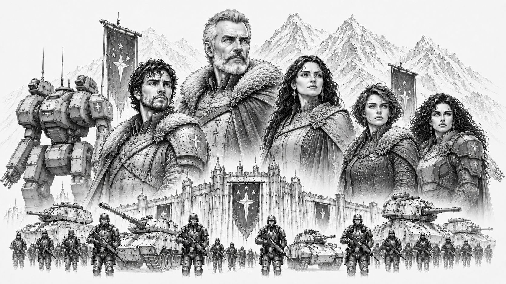

# Starcrest Protectorate

> *“We stand where others would flee.”*  
> — Riker Konnen

*Herzog Riker Konnen and Lady Konnen (center) standing at the center of House Konnen, rulers of the Starcrest Protectorate, surrounded by their bloodline and heirs. Riker's son and heir Korvan Konnen (left), and daughters Lyra and Selene Konnen (far right), stand with the armored ranks of the Storm Guards and the colossal war machines of the Protectorate looming behind them beneath the frozen peaks and fortress-palaces of Khorhall.*

## :material-shield-star: Overview

|  |  |
|---|---|
| :material-bank: **Government Type** | Military Protectorate |
| :material-map-marker: **Capital World** | Khorhall |
| :material-account-group: **Population** | 9.1 billion |
| :material-snowflake: **Environmental Character** | Harsh frontier worlds |
| :material-shield-sword: **Military Specialty** | Defensive Warfare and Heavy Combat |
| :material-handshake: **Strongest Alliance** | Omnisphere Imperium |
| :material-book-open-page-variant: **Words** | “Smoke and Steel.” |

The Starcrest Protectorate is one of the five Great Houses of the Core and among the most respected military powers in known space.

Born from the surviving frontier defense forces of a civilization destroyed during the Collapse, the Protectorate built its identity around endurance, sacrifice, discipline, and the defense of civilization against chaos.

Throughout the Core, the Protectorate is known for:
- resilient soldiers
- harsh frontier culture
- disciplined military tradition
- defensive pragmatism
- personal honor
- loyalty and sacrifice

Unlike the expansionist military philosophy of the Confederate Vanguard Union, the Protectorate views warfare primarily as a necessity of survival rather than a path to glory or conquest.

Protectorate culture teaches that civilization survives only because someone is willing to hold the line when everything else begins to fail.

## History

The origins of the Starcrest Protectorate trace back to the final years of the Collapse.

Before the dark age, the worlds that now form the Protectorate belonged to a larger frontier civilization that ultimately failed during the disintegration of the old order.

As the surrounding territories collapsed, the surviving frontier defense commands consolidated around heavily fortified systems and defensive strongholds.

Though greatly diminished, these isolated defensive forces endured where many larger powers vanished entirely.

Over generations, the survivors gradually expanded outward from these protected regions, rebuilding trade routes, settlements, and military infrastructure across nearby frontier space.

This long struggle for survival profoundly shaped Protectorate identity.

Unlike powers that emerged through conquest, wealth, or political influence, the Protectorate believes its civilization was earned through sacrifice and endurance.

## Khorhall

Khorhall, the capital world of the Protectorate, is infamous throughout the Core for its brutal climate and unforgiving environment.

The planet is characterized by:
- frozen wastelands
- mountainous terrain
- violent storms
- sparse habitable regions
- heavily fortified settlements

Life on Khorhall is difficult even by frontier standards.

Protectorate citizens often regard hardship as necessary for building discipline, resilience, and character.

Many outsiders view the world as harsh and grim, while Protectorate citizens frequently see Core luxury worlds as soft and decadent.

## Government

The Protectorate is governed through a highly structured military-civil administration emphasizing duty, discipline, and public service.

Political authority is distributed among:
- regional protector councils
- military leadership commands
- frontier governors
- defense administrations

Although military service carries enormous prestige within the Protectorate, the government does not glorify conquest or aggression.

Instead, military culture focuses heavily upon:
- defense
- readiness
- sacrifice
- protection of civilians
- preservation of stability

The Protectorate frequently portrays itself as civilization’s shield rather than its sword.

## Society and Culture

Protectorate culture strongly values:
- resilience
- discipline
- personal honor
- loyalty
- sacrifice
- self-reliance

Compared to the aristocratic worlds of Helios or the ceremonial traditions of the Imperium, Protectorate society is generally direct, practical, and austere.

Public respect is earned primarily through:
- service
- competence
- endurance
- reliability

rather than wealth or social status.

Military veterans hold especially respected positions throughout Protectorate society.

Protectorate citizens often possess a deep skepticism toward political excess, aristocratic decadence, and displays of unnecessary luxury.

## Military

The Starcrest Protectorate maintains one of the most disciplined defensive militaries in the Core.

Protectorate doctrine emphasizes:
- fortified defense
- battlefield endurance
- attritional warfare
- disciplined formations
- heavy combat resilience
- survival under extreme conditions

Protectorate mech forces are widely known for:
- durability
- reliability
- heavy armor
- battlefield staying power
- harsh-environment performance

While Protectorate forces are fully capable of offensive operations, they generally favor deliberate, methodical campaigns rather than rapid expansion or reckless aggression.

Protectorate commanders are especially respected for maintaining cohesion and morale under extreme battlefield conditions.

## Relationship with the Imperium

The Protectorate maintains unusually strong ties with the Omnisphere Imperium.

The two powers share several cultural values, including:
- honor
- discipline
- martial tradition
- historical continuity
- personal duty

Imperial observers often view the Protectorate as rugged but honorable allies.

Protectorate leaders generally respect the Imperium’s continuity and historical endurance, even if they occasionally view Imperial aristocratic culture as overly ceremonial.

## Relations with Other Houses

Relations between the Protectorate and the Confederate Vanguard Union are complex.

Both powers respect military strength and discipline, but Protectorate leadership frequently distrusts the Union’s increasingly expansionist tendencies and ideological militarism.

Protectorate criticism of the Helios Sovereignty is often sharper.

Many within the Protectorate view Helios aristocrats as detached from the hardships faced by frontier populations and overly focused on wealth, politics, and luxury.

Relations with Orion Corporate remain generally stable, though Protectorate officials occasionally express concern regarding Orion’s growing dependence upon technological systems and centralized automation.

## Reputation

Throughout the Core, the Starcrest Protectorate is widely viewed as:
- resilient
- disciplined
- honorable
- austere
- dependable
- militarily formidable

Among frontier populations especially, Protectorate soldiers often possess a reputation for reliability and personal courage.

Even rival powers frequently acknowledge the Protectorate’s role in preserving stability throughout dangerous frontier regions.

Many historians believe the Protectorate’s survival through the dark age profoundly shaped its modern worldview: civilization is fragile, and survival ultimately depends upon those willing to defend it.

## Modern Outlook

As tensions throughout the Core continue to intensify, the Protectorate increasingly warns against complacency, political arrogance, and internal division.

Protectorate leadership maintains that the Core has grown dangerously comfortable during centuries of relative stability.

For many within the Protectorate, the lessons of the Collapse remain painfully simple:

civilization survives only so long as someone is willing to stand the line.