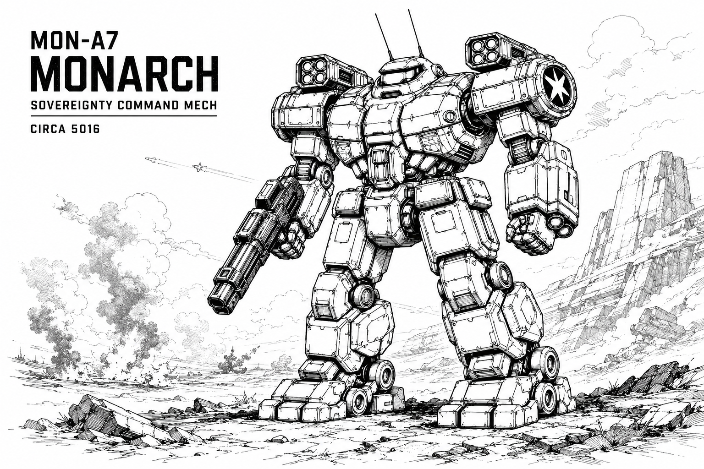

# Monarch

## Specifications

### General Information

| Attribute | Value |
|------------|------------|
| Manufacturer / Affiliation | Helios Sovereignty |
| Model | MON-A7 |
| Class | Sovereignty Command Mech |
| Mass | 950 tons |
| Battlefield Role | Superheavy Assault |
| Cost | 13,835 K |

### Technical Data

| Attribute | Value |
|------------|------------|
| Armor | 240 |
| Internal Structure | 152 |
| Heat Sinks | 14 |
| Speed | 3 |
| Jump Capability | 3 |
| Reactor | 4 |
| Bay Size | 6 |

## Armament

### Weapons

- 2 × 6-Tube Missile Launcher I
- 2 × Heavy Laser I

### Ammunition

- 4 × Missile Ammo

## Overview

The Monarch was never just a war machine—it was designed as a throne of iron for Sovereignty lords. With missile arrays and heavy lasers, it wields devastating power while carrying the regalia of its house. To see a Monarch on the field is to witness Sovereignty authority embodied, its very name leaving no doubt of who rules.

