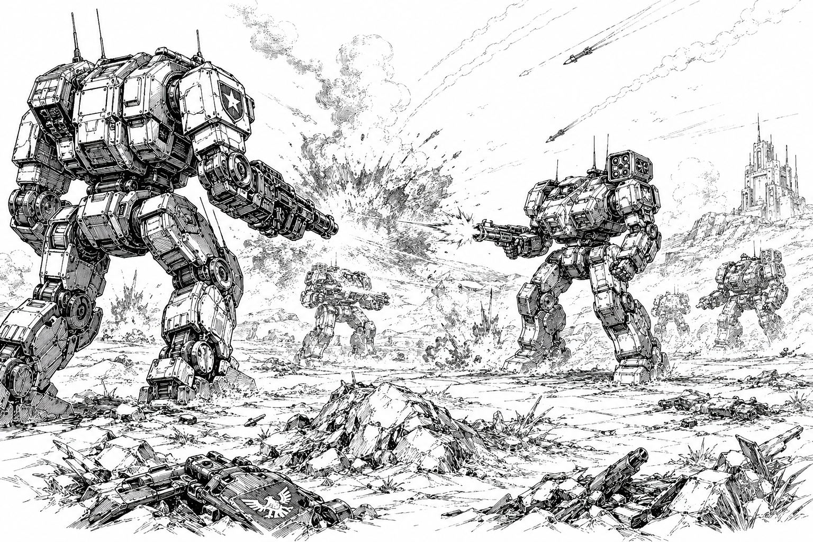

# Mechs of the Core

> *"Fleets threaten worlds. Mechs take them."*  
> — Military proverb of the Core

The Core is dominated by ancient mech traditions, house arsenals, mercenary salvage, and the constant pressure of war. The designs below are grouped by origin rather than by current owner: common designs remain in their own category, while faction-specific machines are listed under the Great House or state most associated with their development and doctrine.

## Why Mechs Dominate the Battlefield

For over a thousand years, military planners have repeatedly predicted the end of the mech. Every time, reality has proven otherwise. While tanks, aircraft, and conventional vehicles remain important parts of modern armies, the mech occupies a unique role that no other platform has successfully replaced. A single trained pilot can command hundreds or even thousands of tons of armored firepower while retaining the flexibility, initiative, and adaptability of an individual soldier.

Mechs thrive because they solve many of the problems that limit conventional armies. They can operate in cities, mountains, forests, swamps, industrial zones, and other terrain that hinders tracked or wheeled vehicles. Their compact fusion cores allow them to operate for months or even years without refueling, dramatically reducing logistical demands and enabling operations deep behind enemy lines. Most designs can be deployed directly from dropships, or even orbital drops, and require far less supporting infrastructure than traditional armored formations.

Perhaps most importantly, mechs concentrate an extraordinary amount of military capability into a single platform. A mech can engage enemy armor, infantry, fortifications, aircraft, and other mechs without requiring specialized variants or extensive support. While [conventional forces](../military/conventional-forces/) often rely upon separate formations of tanks, infantry, artillery, reconnaissance units, and air support working together, a single mech formation can perform many of those battlefield roles on its own. This flexibility allows military commanders to deploy decisive combat power rapidly and with far fewer personnel than a comparable conventional force.

Equally important, mechs are resilient, self-sufficient, and highly adaptable. Damaged machines can often be repaired in the field, rebuilt from salvaged components, or kept operational long after conventional vehicles would be abandoned. While a mech is vastly more expensive than a conventional vehicle, military planners generally regard the investment as worthwhile due to the extraordinary flexibility and battlefield dominance a single mech can provide. Their combination of mobility, endurance, firepower, and battlefield presence has ensured their dominance across the worlds of the Core for centuries.

### Air Power and the Mech Revolution

Military historians often compare the modern mech to the combat aircraft of earlier eras.

Before the rise of mech warfare, air superiority was widely regarded as the decisive factor in major conflicts. Aircraft possessed unmatched speed, reconnaissance capability, and striking power. Armored formations, logistics hubs, and frontline positions could be devastated by concentrated air attacks long before ground forces arrived.

Despite their advantages, aircraft suffered from fundamental limitations. They required extensive support infrastructure, including airfields, maintenance facilities, fuel depots, spare parts, and highly trained ground crews. Aircraft could remain over a battlefield only briefly before returning to base to refuel or rearm, and even heavily armed strike craft were vulnerable to anti-air systems, interceptor aircraft, and adverse environmental conditions.

The emergence of modern war mechs fundamentally altered this equation.

A mech possesses many of the battlefield advantages traditionally associated with aircraft while eliminating many of their weaknesses. Mechs deliver extraordinary firepower, advanced sensors, rapid tactical response, and overwhelming battlefield presence without requiring permanent access to airfields or extensive logistical networks. Capable of remaining operational in the field for weeks, months, or even years with periodic resupply and maintenance, they can operate in adverse weather, occupy strategic terrain, secure objectives, and maintain a continuous military presence.

As a result, military doctrine throughout the Core increasingly shifted away from reliance upon air superiority as the primary determinant of victory. Aircraft remain valuable for reconnaissance, rapid transport, interception, and specialized strike missions, but modern commanders generally regard mechs as the decisive instrument of battlefield control. No other military platform can destroy defenses, defend objectives, and occupy territory simultaneously.

### Pilot Survival and Long-Term Operations

Modern mechs are designed not only as combat platforms but also as long-duration operational shelters capable of sustaining their pilots during extended deployments.

Because mech units frequently operate far from established supply lines, most military and mercenary designs include comprehensive survival equipment intended to support pilots for weeks after becoming isolated from friendly forces. Standard equipment typically includes emergency rations, water reserves, purification systems, medical supplies, shelter components, environmental protection gear, navigation tools, communications equipment, and personal defense weapons.

Ejection systems are generally designed to carry the most critical survival equipment with the pilot. Most modern escape pods contain emergency food supplies, medical kits, distress beacons, survival tools, and environmental protection systems sufficient to sustain a pilot until rescue arrives.

Even when damaged or immobilized, mechs often serve as highly effective survival shelters. Functional reactors can continue supplying power for life-support systems, communications equipment, environmental controls, and sensor arrays long after a machine is no longer combat-capable. In many circumstances, remaining inside a disabled mech is significantly safer than attempting to reach civilization on foot.

This self-sufficiency has shaped military doctrine throughout the Core. A disabled mech is not necessarily considered a lost asset. Recovery teams routinely retrieve damaged machines weeks or even months after combat operations conclude, provided the pilot survives and the chassis remains recoverable. Salvage, reconstruction, and battlefield recovery have therefore become integral parts of mech warfare and contribute significantly to the remarkable longevity of many famous machines.

## History and Origins

The origins of the modern mech predate both the Great Restoration and the rise of the Empire itself.

The earliest predecessors were crude machines: powered industrial exoskeletons used for heavy labor, mining, construction, and hazardous environments. During periods of conflict, some of these machines were armored and armed, producing a variety of primitive combat walkers that historians often describe as little more than mobile pillboxes. Though impressive for their time, these early designs were slow, cumbersome, and of limited military value.

The true revolution came centuries later with the rise of the civilization that would eventually become the Omnisphere Imperium.

Imperial engineers pioneered several technologies that transformed the concept of the mech from an engineering curiosity into the dominant battlefield platform of human civilization. Advances in lightweight high-strength alloys dramatically reduced structural mass while increasing durability. Neural interface systems allowed pilots to control machines with unprecedented precision and responsiveness. Most importantly, the development of compact fusion reactors provided enough energy to power massive armored machines while simultaneously supporting advanced mobility systems and energy weapons.

Combined together, these innovations produced the first true war mechs.

By modern standards these early machines would likely be classified as medium mechs, yet their impact on warfare was extraordinary. They possessed mobility that conventional armored vehicles could not match, firepower capable of reducing fortifications, and operational endurance measured in months rather than days. Defenses that had dominated warfare for generations suddenly became vulnerable.

The strategic consequences were immediate. The Imperium expanded rapidly, leveraging its technological superiority to dominate neighboring powers and establish itself as the largest and most influential state of its age. As Imperial influence spread, so too did mech technology. Rival nations began developing their own designs, and within a few centuries war mechs had become a common feature of military forces throughout known space.

Today, mechs are so deeply integrated into military doctrine that many citizens struggle to imagine warfare without them. Entire civilizations have risen and fallen beneath their shadow.

### The Lytherian Debate

Not all historians agree that the Imperium truly invented the first war mech.

The traditional Imperial account credits Lytherian engineers with the creation of the first practical combat walker and the technologies that made modern mech warfare possible. This remains the dominant historical interpretation.

Some scholars, however, question whether the early Imperium possessed the scientific and industrial base necessary to achieve such a dramatic technological breakthrough independently. Alternative theories suggest that the Lytherians may have acquired, adapted, or reverse-engineered earlier technologies developed elsewhere.

A few historians have even proposed that primitive mech technology may predate the Imperium entirely, originating from civilizations whose names have long since been lost.

No conclusive evidence has emerged to settle the debate. Whatever their ultimate origin, the appearance of the first true war mechs permanently transformed human history and altered the balance of power throughout the Core.

## Core Mech Catalog

| Category | Designs | Notes |
|---|---:|---|
| [Common Core Mechs](common/) | 12 | These widely circulated designs are not exclusive to any one Great House. They appear across mercenary rosters, house garrisons, security contracts, and older battlefield formations throughout the Core. |
| [Confederate Vanguard Union Mechs](union/) | 18 | Union designs emphasize durability, direct firepower, disciplined battlefield roles, and rugged logistics. Their mechs tend to favor practical weapons, thick armor, and formations built around coordinated pressure. |
| [Helios Sovereignty Mechs](helios/) | 18 | Sovereignty machines are prestige weapons as much as battlefield assets: imposing, polished, and expensive, with elite formations built around decisive strikes and symbols of noble power. |
| [Omnisphere Imperium Mechs](imperium/) | 18 | Imperium mechs reflect ancient traditions of martial spectacle and aristocratic warfare. Their machines often combine elegant mobility with vicious close-range killing power. |
| [Orion Corporate Mechs](orion/) | 18 | Corporate mechs showcase Orion’s technical edge: prismatic weapons, advanced shielding, predictive systems, and carefully engineered battlefield efficiency. |
| [Starcrest Protectorate Mechs](starcrest/) | 18 | Protectorate designs are brutal and workmanlike, favoring armor, intimidation, and close-range violence. Many are built to survive ugly fights on industrial worlds and contested borders. |

## Full Roster by Mass

| Mech | Affiliation | Model | Tons | Role | Primary Armament |
|---|---|---|---:|---|---|
| [Hornet](common/hornet.md) | Common | HN-120 | 200 | Scout | 2 × Light Laser I |
| [Zephyr](imperium/zephyr.md) | Omnisphere Imperium | ZPH-01 | 200 | Scout | Medium Blaster I Light Laser I |
| [Photon](orion/photon.md) | Orion Corporate | PHN-50T | 200 | Scout | Medium Prismatic Laser I |
| [Icarus](helios/icarus.md) | Helios Sovereignty | ICS-3G | 250 | Cavalry Striker | Light Laser I 4-Tube Rocket Launcher I |
| [Messenger](helios/messenger.md) | Helios Sovereignty | MSG-1R | 250 | Cavalry Striker | Light Laser I 2-Tube Missile Launcher I |
| [Drake](imperium/drake.md) | Omnisphere Imperium | DRK-06 | 250 | Scout | Medium Blaster I Scorcher I |
| [Ronin](imperium/ronin.md) | Omnisphere Imperium | RON-12 | 250 | Scout | Medium Blaster I 12-Tube Rocket Launcher I |
| [Tachyon](orion/tachyon.md) | Orion Corporate | TCY-2R | 250 | Scout | Medium Prismatic Laser I Light Prismatic Laser I |
| [Raptor](union/raptor.md) | Union | RPT-1R | 250 | Scout | 4-Tube Rocket Launcher I Light Laser I |
| [Vagabond](union/vagabond.md) | Union | VG-7H | 250 | Cavalry Striker | Autocannon I Medium Laser I |
| [Lynx](common/lynx.md) | Common | LNX-40E | 300 | Striker | 2 × Medium Laser I |
| [Pyrefox](imperium/pyrefox.md) | Omnisphere Imperium | PYX-53 | 300 | Scout | 2 × Light Blaster I |
| [Pegasus](helios/pegasus.md) | Helios Sovereignty | PGS-H | 350 | Cavalry Striker | Light Laser I Medium Laser I |
| [Incursor](imperium/incursor.md) | Omnisphere Imperium | ICR-99 | 350 | Striker | 8-Tube Rocket Launcher I Light Blaster I |
| [Zeno](orion/zeno.md) | Orion Corporate | ZEN-400P | 350 | Striker | Medium Prismatic Laser I 8-Tube Rocket Launcher I |
| [Alpha Wolf](union/alpha-wolf.md) | Union | AWLF-5K | 350 | Missile Skirmisher | 2 × Autocannon I |
| [Slugger](union/slugger.md) | Union | SLG-1A | 350 | Cavalry Striker | Heavy Laser I Medium Laser I |
| [Outrider](common/outrider.md) | Common | OR-640 | 400 | Striker | HEC I Light Laser I |
| [Sentry](helios/sentry.md) | Helios Sovereignty | SN-21 | 400 | Fire Support | Long-Range HEC I Light Laser I |
| [Jaguar](imperium/jaguar.md) | Omnisphere Imperium | JGR-72 | 400 | Striker | Medium Blaster I Light Laser I |
| [Ocelot](imperium/ocelot.md) | Omnisphere Imperium | OCE-45 | 400 | Striker | HEC I Light Blaster I |
| [Darius](orion/darius.md) | Orion Corporate | DR-300S | 400 | Missile Skirmisher | 2 × Medium Prismatic Laser I |
| [War Dog](starcrest/war-dog.md) | Starcrest Protectorate | WAR-D1 | 400 | Striker | 2 × Autocannon I |
| [Yeoman](common/yeoman.md) | Common | YM-10F | 450 | Line Mech | Autocannon I Medium Laser I |
| [Lamplighter](helios/lamplighter.md) | Helios Sovereignty | LLT-6Y | 450 | Line Mech | Long-Range HEC I Medium Laser I |
| [Warden](helios/warden.md) | Helios Sovereignty | WRD-N1 | 450 | Cavalry Striker | 2-Tube Missile Launcher I Heavy Laser I |
| [Umbrantarch](imperium/umbrantarch.md) | Omnisphere Imperium | UMB-39 | 450 | Striker | Heavy Blaster I Light Laser I |
| [Reaver](starcrest/reaver.md) | Starcrest Protectorate | RVR-N5 | 450 | Missile Skirmisher | Battle Fist 8-Tube Rocket Launcher I |
| [Lineman](common/lineman.md) | Common | LM-30C | 500 | Brawler | Medium Vulkan I Medium Laser I |
| [Legionnaire](helios/legionnaire.md) | Helios Sovereignty | LGN-A | 500 | Brawler | Medium MAC I 4-Tube Missile Launcher I |
| [Redeemer](imperium/redeemer.md) | Omnisphere Imperium | RDM-10 | 500 | Striker | Heavy Blaster I Light Laser I |
| [Cobalt](orion/cobalt.md) | Orion Corporate | CLT-B1 | 500 | Striker | Impulse Cannon I Medium Prismatic Laser I |
| [Watcher](orion/watcher.md) | Orion Corporate | WAT-002 | 500 | Missile Skirmisher | Medium Prismatic Laser I Light Prismatic Laser I |
| [Crossfire](union/crossfire.md) | Union | CRF-0S | 500 | Brawler | Medium Vulkan I Medium Laser I |
| [Firebrand](union/firebrand.md) | Union | FR-3N | 500 | Brawler | Autocannon I Scorcher I |
| [Lancer](common/lancer.md) | Common | LNC-220 | 550 | Line Mech | Heavy Laser I Medium Laser I |
| [Herald](helios/herald.md) | Helios Sovereignty | HRL-6D | 550 | Brawler | 6-Tube Missile Launcher I Heavy Laser I |
| [Paladin](helios/paladin.md) | Helios Sovereignty | PLDN-00C | 550 | Brawler | Light MAC I 12-Tube Rocket Launcher I |
| [Nagara](imperium/nagara.md) | Omnisphere Imperium | NGA-47 | 550 | Striker | Heavy Vulkan I HEC I |
| [Deviance](orion/deviance.md) | Orion Corporate | DEV-2N | 550 | Fire Support | Heavy Prismatic Laser I Medium Prismatic Laser I |
| [Xerxes](orion/xerxes.md) | Orion Corporate | XER-200A | 550 | Fire Support | 2 × Impulse Cannon I |
| [Harbinger](starcrest/harbinger.md) | Starcrest Protectorate | HAR-G9 | 550 | Brawler | Battle Fist Medium Vulkan I |
| [Jackal](starcrest/jackal.md) | Starcrest Protectorate | JCK-L4 | 550 | Brawler | Heavy Laser I Medium Laser I |
| [Champion](common/champion.md) | Common | CH-70K | 600 | Missile Skirmisher | 4-Tube Missile Launcher I Light Vulkan I |
| [Longstrike](common/longstrike.md) | Common | LG-210 | 600 | Fire Support | 2 × Autocannon I |
| [Protector](helios/protector.md) | Helios Sovereignty | PRO-T1 | 600 | Fire Support | Heavy Laser I 4-Tube Missile Launcher I |
| [Drakkon](imperium/drakkon.md) | Omnisphere Imperium | DRK-82 | 600 | Line Mech | Medium Blaster I Light Laser I |
| [Blaze Bringer](orion/blaze-bringer.md) | Orion Corporate | BLZ-360K | 600 | Shielded Assault | 2 × Medium Prismatic Laser I |
| [Echelon](orion/echelon.md) | Orion Corporate | ECH-4R | 600 | Shielded Assault | 2 × Light Prismatic Laser I |
| [Beast](starcrest/beast.md) | Starcrest Protectorate | BST-R3 | 600 | Brawler | Battle Fist Ultra Vulkan I |
| [Instigator](starcrest/instigator.md) | Starcrest Protectorate | INS-G9 | 600 | Brawler | Heavy HEC I 12-Tube Rocket Launcher I |
| [Dragoon](union/dragoon.md) | Union | DGN-8S | 600 | Line Mech | HEC I Heavy Vulkan I |
| [Ordosmech](imperium/ordosmech.md) | Omnisphere Imperium | ORD-07 | 650 | Missile Skirmisher | 24-Tube Rocket Launcher I Light Blaster I |
| [Warclaw](imperium/warclaw.md) | Omnisphere Imperium | WCL-61 | 650 | Line Mech | Medium Blaster I Light Laser I |
| [Reckoner](orion/reckoner.md) | Orion Corporate | REK-4M | 650 | Shielded Assault | Heavy Prismatic Laser I Impulse Cannon I |
| [Razorback](starcrest/razorback.md) | Starcrest Protectorate | RZK-7B | 650 | Brawler | Battle Fist Heavy Laser I |
| [Jackman](union/jackman.md) | Union | JCK-77 | 650 | Brawler | Light Vulkan I Heavy Laser I |
| [Maverick](union/maverick.md) | Union | MAV-8K | 650 | Brawler | HEC I 12-Tube Rocket Launcher I |
| [Bulldog](common/bulldog.md) | Common | BD-770 | 700 | Assault | 2 × HEC I |
| [Marksman](common/marksman.md) | Common | MK-350 | 700 | Assault | 2 × Light Vulkan I |
| [Dark Knight](helios/dark-knight.md) | Helios Sovereignty | DK-2R | 700 | Assault | Long-Range HEC I Heavy Laser I |
| [Nightwing](imperium/nightwing.md) | Omnisphere Imperium | NGT-W4 | 700 | Assault | HEC I Medium Blaster I |
| [Eradicator](orion/eradicator.md) | Orion Corporate | ERAD-120R | 700 | Shielded Assault | HEC I 8-Tube Rocket Launcher I |
| [Zealot](orion/zealot.md) | Orion Corporate | ZEL-20T | 700 | Shielded Assault | Heavy Prismatic Laser I Medium Prismatic Laser I |
| [Neanderthal](starcrest/neanderthal.md) | Starcrest Protectorate | NEA-R8 | 700 | Assault | 2 × HEC I |
| [Patriot](union/patriot.md) | Union | PTR-007 | 700 | Assault | 2 × Autocannon I |
| [Gladiator](common/gladiator.md) | Common | GL-882 | 750 | Assault | Heavy Vulkan I 4-Tube Rocket Launcher I |
| [Excalibur](helios/excalibur.md) | Helios Sovereignty | EX-3R | 750 | Assault | Medium MAC I Light MAC I |
| [Endermech](orion/endermech.md) | Orion Corporate | END-550M | 750 | Shielded Assault | HEC I Heavy Prismatic Laser I |
| [Barbarian](starcrest/barbarian.md) | Starcrest Protectorate | BAR-N8 | 750 | Assault | Battle Fist I Smoke Shot I |
| [Challenger](union/challenger.md) | Union | CHL-4R | 750 | Assault | 2 × Medium Laser I |
| [Hammerhead](union/hammerhead.md) | Union | HMR-4T | 750 | Assault | 2 × HEC I |
| [Kingsguard](common/kingsguard.md) | Common | KG-950 | 800 | Assault | 6-Tube Missile Launcher I Heavy Laser I |
| [Lionheart](helios/lionheart.md) | Helios Sovereignty | LHR-5T | 800 | Assault | Long-Range HEC I Heavy Laser I |
| [Onagor](imperium/onagor.md) | Omnisphere Imperium | ONA-37 | 800 | Assault | Heavy Vulkan I Heavy Blaster I |
| [Praetorian](imperium/praetorian.md) | Omnisphere Imperium | PRA-97 | 800 | Assault | 2 × HEC I |
| [Markov](orion/markov.md) | Orion Corporate | MKV-60L | 800 | Shielded Assault | 2 × Heavy Prismatic Laser I |
| [Overlord](starcrest/overlord.md) | Starcrest Protectorate | OVR-L1 | 800 | Assault | Heavy Vulkan I Heavy Laser I |
| [Brigadier](union/brigadier.md) | Union | BRG-88R | 800 | Assault | 2 × 4-Tube Missile Launcher I |
| [Lancelot](helios/lancelot.md) | Helios Sovereignty | LNC-10T | 850 | Superheavy Assault | 6-Tube Missile Launcher I Medium MAC I |
| [Neomech](imperium/neomech.md) | Omnisphere Imperium | NEO-60 | 850 | Superheavy Assault | 2 × 24-Tube Rocket Launcher I |
| [Star Slayer](imperium/star-slayer.md) | Omnisphere Imperium | SLY-10 | 850 | Superheavy Assault | Heavy Blaster I Light Blaster I |
| [Nebuchadnezzar](orion/nebuchadnezzar.md) | Orion Corporate | NEB-Z001 | 850 | Superheavy Assault | Heavy Prismatic Laser I Medium Prismatic Laser I |
| [Rift Master](orion/rift-master.md) | Orion Corporate | RFM-220C | 850 | Superheavy Assault | 2 × Medium Prismatic Laser I |
| [Berserker](starcrest/berserker.md) | Starcrest Protectorate | BER-Z3 | 850 | Superheavy Assault | Battle Fist I Medium Laser I |
| [Colossus](helios/colossus.md) | Helios Sovereignty | COL-U5 | 900 | Superheavy Assault | Heavy MAC I Heavy Laser I |
| [Great Sword](helios/great-sword.md) | Helios Sovereignty | SWRD-001 | 900 | Superheavy Assault | 2 × Light MAC I |
| [Aeon](orion/aeon.md) | Orion Corporate | AE-550X | 900 | Superheavy Assault | 2 × Heavy Prismatic Laser I |
| [Bulwark](union/bulwark.md) | Union | BLW-5K | 900 | Superheavy Assault | Heavy Laser I Medium Laser I |
| [Sword Breaker](union/sword-breaker.md) | Union | SBRK-7R | 900 | Superheavy Assault | 2 × Heavy Vulkan I |
| [Monarch](helios/monarch.md) | Helios Sovereignty | MON-A7 | 950 | Superheavy Assault | 2 × 6-Tube Missile Launcher I |
| [Thunder God](starcrest/thunder-god.md) | Starcrest Protectorate | TDR-G7 | 950 | Superheavy Assault | Heavy HEC I Heavy Vulkan I |
| [Punisher](union/punisher.md) | Union | PNR-004 | 950 | Superheavy Assault | HEC I Ultra Vulkan I |
| [Olympian](helios/olympian.md) | Helios Sovereignty | OLYM-D | 1000 | Superheavy Assault | Heavy MAC I Long-Range HEC I |
| [Doomhammer](starcrest/doomhammer.md) | Starcrest Protectorate | DOOM-H2 | 1000 | Superheavy Assault | Battle Fist Ultra Vulkan I |
| [Infernal](starcrest/infernal.md) | Starcrest Protectorate | INF-L9 | 1000 | Superheavy Assault | 2 × Heavy Laser I |
| [Gallimagus](union/gallimagus.md) | Union | GLM-8G | 1000 | Superheavy Assault | 2 × HEC I |
| [Liberator](union/liberator.md) | Union | LBR-9D | 1000 | Superheavy Assault | Ultra Vulkan I 6-Tube Missile Launcher I |
| [Brute Machine](starcrest/brute-machine.md) | Starcrest Protectorate | BRT-100R | 1050 | Superheavy Assault | Battle Fist Ultra Vulkan I |
| [Cromagnon](starcrest/cromagnon.md) | Starcrest Protectorate | CRM-N2 | 1100 | Superheavy Assault | Battle Fist Heavy HEC I |
| [Juggernaut](starcrest/juggernaut.md) | Starcrest Protectorate | JGR-N6 | 1100 | Superheavy Assault | Battle Fist 8-Tube Rocket Launcher I |
| [Ragnarok](starcrest/ragnarok.md) | Starcrest Protectorate | RGK-5000K | 1200 | Superheavy Assault | Heavy HEC I Heavy Vulkan I |
