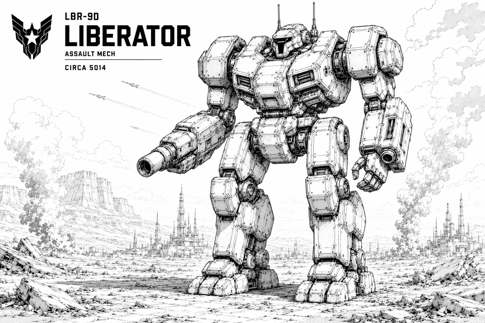

# Liberator

## Specifications

### General Information

| Attribute | Value |
|------------|------------|
| Manufacturer / Affiliation | Union |
| Model | LBR-9D |
| Mass | 1000 tons |
| Battlefield Role | Superheavy Assault |
| Cost | 13,300 K |

### Technical Data

| Attribute | Value |
|------------|------------|
| Armor | 320 |
| Internal Structure | 160 |
| Heat Sinks | 20 |
| Speed | 3 |
| Reactor | 5 |
| Bay Size | 7 |

## Armament

### Weapons

- Ultra Vulkan I
- 6-Tube Missile Launcher I
- Heavy Laser I
- 2 × Medium Laser I

### Ammunition

- 3 × Ultra Vulkan Ammo
- 2 × Missile Ammo

## Overview

Developed during the Long Exile by remnants of the fallen Empire, the Liberator was designed to spearhead counteroffensives and break enemy sieges. It played a decisive role in the Great Restoration, leading the charge to reclaim the Core worlds. Adopted as the Union’s premiere assault mech, it endures as both battlefield powerhouse and enduring symbol of liberation.
