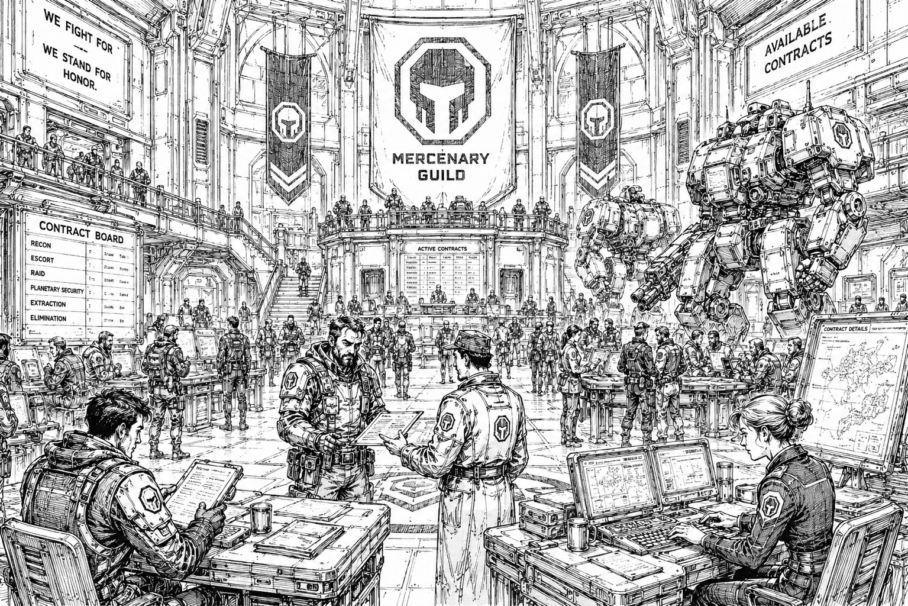

# Mercenary Guild

> *“Where words bind war.”*  
> — Guild motto

## :material-scale-balance: Overview

|                                                   |                                              |
| ------------------------------------------------- | -------------------------------------------- |
| :material-domain: **Organization Type**           | Mercenary Regulatory Authority               |
| :material-map-marker: **Headquarters**            | Drake's Landing                              |
| :material-file-document: **Primary Function**     | Contract Arbitration and Mercenary Oversight |
| :material-gavel: **Political Status**             | Neutral Institution                          |
| :material-cash-multiple: **Primary Influence**    | Licensing, Contracts, Reputation Systems     |
| :material-book-open-page-variant: **Guild Motto** | "Where Words Bind War."                      |

The Mercenary Guild is one of the most influential institutions in the Core and the primary authority governing mercenary activity throughout civilized space.

Officially neutral and recognized by both the Star Regency and the Great Houses, the Guild exists to regulate the vast system of private warfare upon which much of the modern Core depends. It oversees company registration, contract enforcement, arbitration, salvage rights, payment guarantees, reputation records, and operational conduct for thousands of mercenary organizations.

Most legal mercenary work passes through the Guild Open Board, a vast contract exchange network that connects employers with registered companies across known space. Through its licensing systems, arbitration courts, and reputation records, the Guild provides the structure that allows independent military forces to operate on a scale that would otherwise be impossible.

Although it commands only modest military forces of its own, the Guild possesses immense economic and legal influence. Entire frontier economies, military campaigns, and political agreements depend upon the assumption that Guild contracts will be honored and Guild rulings respected.

In practice, the Mercenary Guild serves as one of the primary institutions preventing private warfare from descending into uncontrolled chaos.

## Origins

The Mercenary Guild traces its origins to the early mercenary settlements that emerged on Drake's Landing centuries after the world was granted to the legendary commander Drake.

As more companies established permanent operations on the planet, the growing mercenary community faced increasingly familiar problems. Contracts were disputed, employers refused payment, salvage claims overlapped, and rival companies occasionally settled disagreements through violence rather than negotiation.

Initially these matters were handled informally through agreements between senior commanders and respected company leaders. Over time, however, the growing volume of mercenary activity made such arrangements increasingly difficult to maintain.

The largest companies operating from Drake's Landing eventually established common standards for contract enforcement, arbitration, reputation tracking, and operational conduct. These early agreements proved remarkably successful and gradually evolved into the institution now known as the Mercenary Guild.

By the time the Great Houses and the Star Regency formally recognized the Guild, it had already become the accepted authority governing mercenary affairs throughout much of civilized space.

As a result, the Guild occupies a unique position within the Core. Unlike many major institutions, its authority was not granted by governments. It was built by the mercenary community itself and later acknowledged by the powers of the age.

## Philosophy

The Guild's guiding principle is summarized in its motto:

> *"Where Words Bind War."*

To the Mercenary Guild, warfare is not an aberration of civilization. It is a permanent feature of it.

Guild doctrine holds that conflict can never be eliminated. Worlds will continue to compete for resources, governments will continue to pursue power, and soldiers will continue to fight for causes, employers, and survival. The Guild therefore does not seek to prevent war. It seeks to contain it.

Within Guild philosophy, contracts serve a purpose far greater than commerce. A contract defines obligations, limits escalation, establishes accountability, and creates a framework through which violence can occur without collapsing into chaos. Every signed agreement represents a set of boundaries that all parties understand before the first shot is fired.

Guild officials often argue that civilization itself depends upon enforceable agreements. Without trusted contracts, employers would refuse payment, companies would ignore obligations, salvage disputes would become wars, and every battlefield victory would invite a dozen new conflicts.

For this reason, the Guild treats contracts with near-religious seriousness. To Guild administrators, a signed agreement is not merely a business arrangement. It is one of the few things standing between organized warfare and anarchy.

## Drake's Landing

The Guild maintains its headquarters on [Drake's Landing](../../places/drakes-landing/), the mercenary capital of civilized space and the historical birthplace of the Guild itself.

Although located within the borders of the Starcrest Protectorate, Drake's Landing operates as neutral ground for mercenary activity throughout the Core. Its contract halls, recruitment centers, repair facilities, arbitration courts, and Open Board exchanges attract employers and companies from every major power.

The relationship between Drake's Landing and the Guild is inseparable. The earliest foundations of Guild authority emerged from agreements between the mercenary companies that gathered on the world centuries ago. As those agreements evolved into formal systems of arbitration, licensing, and contract enforcement, Drake's Landing gradually became the administrative and cultural center of regulated mercenary activity.

Today, thousands of pilots, mechanics, recruiters, brokers, salvagers, and company representatives pass through Drake's Landing every cycle. Guild influence is strongest there, and many frontier pilots joke that a company is not truly legitimate until it has survived at least one contract season on Landing.

The world remains both sanctuary and proving ground for mercenary organizations. Companies are founded there, fortunes are made there, and reputations are often won or lost there. For many mercenaries, a Guild seal and a successful contract on Drake's Landing mark the beginning of a real career.

## The Open Board

The Open Board is the Guild's centralized contract exchange network and the primary marketplace for mercenary work throughout the Core.

Governments, corporations, frontier settlements, noble houses, and private citizens may post contracts through the Board. Registered companies review available assignments, negotiate terms, and secure Guild-backed agreements through its systems.

Most mercenary careers are built through the Open Board. A company's reputation, operational history, and Guild standing heavily influence what work becomes available and how much employers are willing to pay.

Although alternatives exist in frontier space, the Open Board remains the dominant mechanism through which private military force is bought and sold throughout civilized space. Many economists consider it one of the most important commercial institutions in the Core, influencing everything from frontier security to interstellar trade.

## Licensing, Reputation, and Arbitration

Most recognized mercenary companies operate under Guild registration.

Registration grants access to the Open Board, Guild arbitration services, payment guarantees, recognized salvage rights, and official company records. While operating outside Guild authority is possible, particularly in the deep frontier, unregistered organizations are frequently regarded as pirates, raiders, or independent militias rather than legitimate mercenary companies.

The Guild maintains extensive records covering contract fulfillment, battlefield conduct, civilian casualty reports, disciplinary actions, and operational history. These records form the basis of a company's reputation, which many mercenaries consider more valuable than military strength itself.

Reliable companies with strong records often receive better contracts, higher pay, favorable salvage terms, and long-term relationships with major employers. Conversely, companies that engage in piracy, violate contracts, abandon employers, or commit major atrocities may face sanctions, suspensions, or formal blacklisting.

The Guild also serves as the primary arbitration authority for mercenary disputes throughout the Core. Payment disagreements, salvage claims, contract interpretation, and operational conflicts are routinely settled through Guild courts and arbitration panels.

Although the Guild possesses limited military power, its rulings carry significant weight. Most governments, corporations, and mercenary organizations comply not because they are forced to, but because confidence in the entire mercenary system depends upon the belief that contracts will be honored and disputes can be resolved peacefully.

A House governor may ignore a Guild ruling. The Guild cannot stop them. What it can do is ensure that every mercenary company in the Core learns of it.

## Political Relationships

The Mercenary Guild occupies a unique position within the political structure of the Core.

Officially neutral and recognized by both the Star Regency and the Great Houses, the Guild serves as the accepted authority governing mercenary affairs throughout civilized space. All major powers make extensive use of mercenary companies, whether for frontier defense, anti-piracy operations, convoy protection, infrastructure security, or less public activities.

The Guild generally avoids direct involvement in House rivalries. Maintaining neutrality is considered essential to preserving institutional legitimacy. While House sponsorship of mercenary companies is common, Guild officials rarely concern themselves with who employs a company so long as Guild rules and contractual obligations are respected.

Contrary to popular belief, the Guild is not a major military power. It maintains station defense forces, limited patrol fleets, investigative divisions, and security detachments primarily for the protection of Guild infrastructure and personnel.

Its true authority derives from something far more valuable: legitimacy.

The Great Houses tolerate and support the Guild because it provides a framework through which private warfare can remain predictable and manageable. The Star Regency relies upon it for many of the same reasons. Few institutions are better positioned to prevent frontier disputes, mercenary conflicts, and proxy wars from escalating into direct inter-house confrontation.

For this reason, the Guild often exerts influence far beyond what its military strength alone would suggest.

## Guild Culture

Guild culture is highly procedural, pragmatic, and famously indifferent to ideology.

Guild officials are less concerned with why a conflict occurs than with whether its terms are clearly defined, enforceable, and survivable. Contracts, records, precedents, and arbitration decisions occupy a central place within Guild life, and many officials view predictability as a virtue equal to courage or military skill.

This mindset often places the Guild at odds with both politicians and mercenaries. House leaders frequently become frustrated by Guild insistence on procedure, while mercenary commanders sometimes view Guild administrators as bureaucrats who have forgotten what battlefields look like.

Yet even many critics acknowledge the Guild's importance. For countless companies, the Guild represents the difference between professional military service and outright piracy. A Guild seal opens doors throughout the Core, while the loss of one can end a career.

Among mercenaries, opinions on the Guild vary widely. Some regard it as civilization's necessary referee. Others see it as overly bureaucratic and increasingly favorable toward large companies and House-backed organizations.

Despite these complaints, few companies willingly operate outside Guild systems for long.

As one old Landing saying puts it:

> *"No steel rides long without a Guild seal."*

## Modern Outlook

As tensions between the Great Houses continue to rise, the Mercenary Guild faces increasing pressure from every direction.

Expanding frontier conflicts, growing pirate activity, House-backed proxy wars, and increasingly aggressive political rivalries have strained many of the systems that have governed mercenary affairs for centuries. Guild arbitrators report growing disputes over salvage rights, contract interpretation, and the use of mercenary forces in conflicts that increasingly resemble undeclared wars.

Many within the Guild fear that its greatest challenge is no longer enforcing individual contracts, but preserving confidence in the system itself. The Guild can function only so long as employers, governments, and mercenary companies continue to accept its authority and honor its rulings.

For now, the Guild remains one of the few institutions trusted across factional lines. Whether it can maintain that position in the years ahead remains an open question.

> *"Civilizations do not collapse when wars begin. They collapse when nobody agrees on the rules."*
> — Guild arbitration saying
