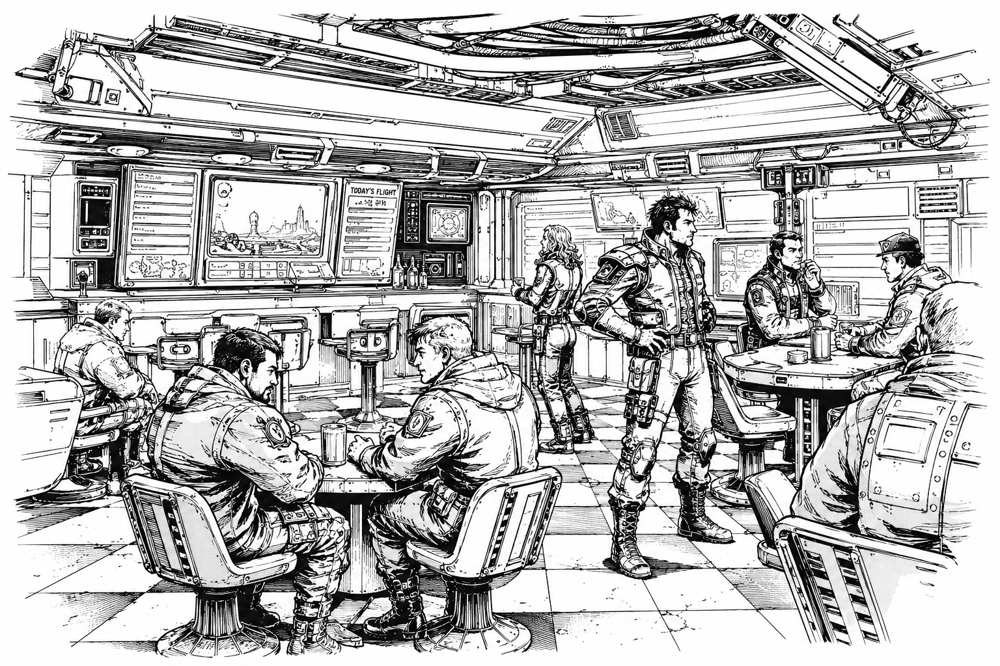

# Mercenaries

> *“No war is won for free.”*  
> — Mercenary saying

## :material-sword-cross: Overview

|                                                     |                                                 |
| --------------------------------------------------- | ----------------------------------------------- |
| :material-domain: **Common Name**                   | Metal Mercs                                     |
| :material-map-marker: **Primary Hub**               | [Drake's Landing](../places/drakes-landing/) |
| :material-gavel: **Primary Authority**              | [Mercenary Guild](../mercenaries/guild/)          |
| :material-robot-industrial: **Primary Equipment**   | [War Mechs](../mechs/)            |
| :material-cash: **Primary Occupation**              | Private Military Contracting                    |
| :material-book-open-page-variant: **Common Saying** | “No House Rules The Frontier.”                  |

Mercenaries—commonly known throughout civilized space as *Metal Mercs*—are private military organizations operating throughout the Core and frontier regions. Built around the deployment of [mechs](../../technology/mechs/), mercenary companies undertake everything from frontier defense and anti-piracy operations to reconnaissance, convoy escort, industrial security, and large-scale military campaigns.

Although officially independent, mercenary forces have become one of the defining institutions of the modern age. While the Great Houses publicly avoid direct warfare under the authority of the Star Regency, mercenary companies provide a means through which conflicts can be fought, influence projected, and political objectives pursued without openly violating the peace.

Mercenary organizations vary enormously in size. At the top stand the four Greater Companies, military powers whose strength rivals that of the Great Houses themselves. Beneath them are the famous [Lesser Companies](../mercenaries/lesser-mercenary-units/), followed by hundreds of [Minor Mercenary Units](../mercenaries/minor-mercenary-units/) operating throughout civilized space. At the foundation of the profession are the countless [Free Jacks](../mercenaries/free-jacks/), independent pilots and small crews seeking contracts wherever work can be found.

Throughout the frontier, mercenary companies are viewed with a mixture of admiration, suspicion, and necessity. To some worlds they are protectors. To others they are opportunists. In many regions they are simply the closest thing available to a standing army.

Whatever their reputation, few institutions have shaped the modern Core more profoundly than the Metal Mercs.

## Origins

Mercenaries have existed throughout human history, including during the age of the Old Empire. For much of that era, however, they occupied a relatively minor role compared to the vast military forces maintained by the Empire's authorities.

That changed with the Fall.

The collapse of the Empire shattered the political and military order that had governed human space for centuries. Countless soldiers suddenly found themselves without employers, without nations, and often without any reliable means of support. At the same time, thousands of worlds lost the protection of Empire fleets and garrisons. Across known space, governments weakened, trade routes fractured, and entire regions descended into instability.

Into this vacuum stepped pirates, raiders, warlords, private armies, and mercenaries.

Throughout the Dark Age, independent military companies became a common feature of life. Some protected vulnerable settlements and trade routes. Others fought for local rulers, corporate interests, or whoever could afford their services. Many drifted between the roles of soldier, salvager, privateer, and outright bandit as circumstances demanded.

By the time of the Great Restoration, mercenary culture had already become deeply entrenched throughout human space. The Restoration did not create the profession so much as transform it. Organizations such as the Mercenary Guild helped formalize contracts, establish standards, and bring greater legitimacy to an industry that had often operated in the gray space between military service and organized violence.

Today, mercenary activity extends far beyond the boundaries of the Core. From the frontier worlds to the edge of explored space, independent military companies remain one of the most common and influential forces in human civilization.

## The Mercenary Guild

→ See also: [Mercenary Guild](../mercenaries/guild/)

Most recognized mercenary companies operate under the authority of the Mercenary Guild, the neutral institution responsible for regulating private warfare throughout civilized space.

The Guild oversees company registration, contract enforcement, arbitration, reputation tracking, salvage rights, and operational disputes. Through its licensing systems and Open Board exchanges, it provides the framework that allows thousands of independent military organizations to operate across the Core and frontier regions.

For many employers, a Guild seal represents legitimacy. For many mercenaries, it represents opportunity. Companies that maintain strong Guild records often gain access to better contracts, favorable salvage rights, and long-term relationships with major employers. Those that lose Guild standing may find themselves effectively locked out of civilized mercenary work.

Although the Guild commands only modest military forces of its own, its influence extends throughout human space. Few institutions have done more to transform mercenary warfare from a collection of armed companies into a profession.

## Mercenary Companies

Mercenary organizations vary enormously in size, capability, and influence.

At the top of the profession stand the four [Greater Companies](../mercenaries/greater-mercenary-units/), military powers whose strength rivals that of the Great Houses themselves. Beneath them are the famous [Lesser Companies](../mercenaries/lesser-mercenary-units/), organizations large enough to shape regional conflicts and influence interstellar politics. Together, these elite commands represent the most powerful independent military forces in known space.

The vast majority of professional mercenaries serve within [Minor Mercenary Units](../mercenaries/minor-mercenary-units/). Numbering in the hundreds, these companies range from single-company formations to reinforced wards capable of conducting extended military operations. Though smaller than the great commands, many possess long histories, respected commanders, and distinguished combat records.

At the foundation of the profession are the countless [Free Jacks](../mercenaries/free-jacks/), independent pilots and small crews operating without the backing of a major company. Many never rise beyond a handful of mechs. Others eventually earn enough reputation to establish companies of their own.

Regardless of size, a mercenary company's most valuable asset is often its reputation. Reliable organizations gain access to better contracts, stronger employers, and more favorable salvage terms. Poor reputations can rapidly destroy a company's access to financing, recruits, and future work.

Among mercenaries, there is a common belief that machines win battles, but reputation wins careers.

## Mercenary Life

Life as a mercenary is often romanticized throughout the Core, but the reality is far less glamorous.

Most mercenaries spend far more time negotiating contracts, maintaining equipment, training crews, and managing logistics than they do fighting. A successful company must function as both a military organization and a business. Ammunition must be purchased, reactors maintained, mechs repaired, pilots paid, and transport secured. A company that wins battles but cannot manage its finances rarely survives for long.

The profession attracts a wide variety of people. Former House soldiers, frontier militias, displaced nobles, salvagers, adventurers, and second-generation mercenaries can all be found beneath the banners of independent companies. Some seek wealth. Others seek freedom, glory, revenge, or simply a place to belong.

Despite their reputation for independence, mercenary organizations are often built around loyalty and personal relationships. Crews may spend years or even decades serving alongside one another, creating bonds that frequently become stronger than national or political affiliations.

Reputation occupies a central place in mercenary culture. A company known for honoring contracts, protecting its personnel, and treating employers fairly can secure work almost anywhere in civilized space. Companies that betray employers, abandon allies, or engage in unnecessary brutality often discover that their reputations travel faster than they do.

This emphasis on reputation has produced a distinctive culture throughout the profession. Mercenaries frequently judge one another less by ideology or faction and more by competence, reliability, and battlefield conduct. Among veterans, a respected name is often considered more valuable than a powerful mech.

As one old mercenary saying goes:

> *"A mech can be replaced. A reputation can't."*

## Drake's Landing

→ See also: [Drake's Landing](../../places/drakes-landing/)

The heart of mercenary culture lies on Drake's Landing, the neutral world that serves as the profession's unofficial capital.

Home to the Mercenary Guild and the largest concentration of mercenary companies in civilized space, Drake's Landing functions as a meeting place for pilots, recruiters, employers, mechanics, salvagers, and military contractors from every corner of the Core and Frontier. Its contract halls, Open Board exchanges, repair facilities, and training grounds form the center of the modern mercenary economy.

For generations, aspiring mercenaries have traveled to Drake's Landing seeking opportunity. Some arrive as Free Jacks looking for their first contract. Others come representing famous companies whose names are known across the Core. Regardless of status, nearly every mercenary eventually passes through Landing.

Among mercenaries, there is a common saying:

> *"Every company starts on Landing. Not every company leaves."*

## Relationship with the Great Houses

All five Great Houses make extensive use of mercenary forces.

Officially, mercenary companies are employed for frontier defense, anti-piracy operations, convoy security, colonial expansion, and infrastructure protection. In practice, they frequently serve as instruments of influence in territorial disputes, proxy conflicts, covert operations, and political rivalries.

This relationship benefits both sides. Mercenary companies gain access to lucrative contracts, equipment, and political connections, while the Great Houses acquire military capabilities that can be deployed without fully committing their own armed forces.

The relationship is not without tension. House leaders often view mercenaries as useful but unpredictable, while many mercenaries regard the Houses as employers rather than masters. Most companies maintain their independence carefully, knowing that excessive dependence upon a single patron can quickly transform a mercenary command into a House auxiliary in all but name.

Even the largest companies must navigate these relationships carefully. A contract may provide wealth and influence, but it can also draw a company into conflicts far larger than it intended to fight.

## Frontier Importance

Nowhere are mercenaries more important than in the Frontier.

Beyond the heavily populated worlds of the Core, many settlements lack the resources to maintain standing militaries capable of defending themselves against pirates, raiders, hostile neighbors, or local warlords. For these worlds, mercenary companies often provide the only practical source of military protection.

Mercenaries escort convoys, defend colonies, suppress pirate activity, train local militias, and secure trade routes across vast regions where government authority is weak or nonexistent. Entire frontier economies depend upon their presence.

As a result, mercenaries are often viewed differently on the Frontier than within the Core. Core citizens may see them as opportunists or soldiers for hire. Frontier populations frequently view them as protectors, partners, and sometimes the only barrier between civilization and chaos.

It is this constant demand for security that ensures the profession continues to thrive far beyond the borders of the Great Houses.

## Modern Outlook

Mercenary activity remains at some of the highest levels seen since the Great Restoration.

Expanding frontier settlements, growing pirate activity, renewed competition for resources, and rising tensions between the Great Houses have created unprecedented demand for experienced military contractors. Many companies have prospered as a result, while new organizations appear on the Open Board every cycle.

Yet many veterans view the future with caution. The political order established after the Great Restoration has preserved relative stability for centuries, but few believe it will last forever. Proxy conflicts are growing larger, contracts are becoming more dangerous, and some fear the Core is drifting toward a period of instability not seen since the Dark Age.

For now, the Metal Mercs continue to thrive in the space between peace and war.

> *"When the Houses stop talking, the contracts get bigger."*
>
> — Mercenary saying

