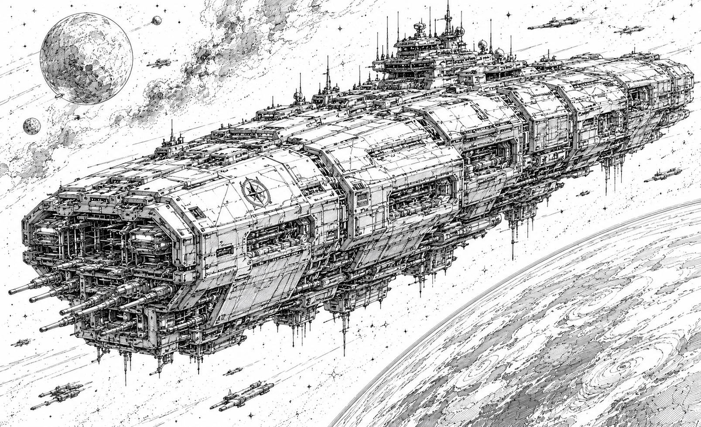

# Battlestars

> *"A hundred Battlestars once guarded the Empire. Twelve now remain."*
>
> — StarCom historical archives

## Current Battlestars

| Battlestar                                                | Faction                    | Heritage          |    Crew | Embarked Mechs |
| --------------------------------------------------------- | -------------------------- | ----------------- | ------: | -------------: |
| [Odin](../battlestars/odin.md)                            | Starcrest Protectorate     | Restoration Fleet |  88,000 |          4,000 |
| [Warden's Might](../battlestars/wardens-might.md)         | Starcrest Protectorate     | Last Warden       |  72,000 |          3,200 |
| [Valhalla II](../battlestars/valhalla-ii.md)              | Starcrest Protectorate     | Last Warden       |  68,000 |          3,000 |
| [Radiant Dawn](../battlestars/radiant-dawn.md)            | Helios Sovereignty         | Restoration Fleet |  96,000 |          4,400 |
| [Sunfire](../battlestars/sunfire.md)                      | Helios Sovereignty         | Restoration Fleet |  92,000 |          4,200 |
| [Metaforge](../battlestars/metaforge.md)                  | Orion Corporate            | Restoration Fleet |  56,000 |          2,800 |
| [Chronex](../battlestars/chronex.md)                      | Orion Corporate            | Restoration Fleet |  54,000 |          2,600 |
| [Indomitable](../battlestars/indomitable.md)              | Confederate Vanguard Union | Restoration Fleet | 112,000 |          5,600 |
| [Wrath Bringer](../battlestars/wrath-bringer.md)          | Confederate Vanguard Union | Restoration Fleet | 106,000 |          4,200 |
| [Justice](../battlestars/justice.md)                      | Confederate Vanguard Union | Restoration Fleet | 102,000 |          3,800 |
| [Eternity's Arcanum](../battlestars/eternitys-arcanum.md) | Omnisphere Imperium        | Last Warden       | 132,000 |          7,200 |
| [Aetherius V](../battlestars/aetherius-v.md)              | Omnisphere Imperium        | Last Warden       |  64,000 |          3,200 |

---

## Heirs of the Empire

> *"Battlestars are not built. They are inherited."*
>
> — Protectorate naval saying

Battlestars are the largest warships operating within known space and among the most valuable assets possessed by the Great Houses.

Historical records suggest that the Old Empire once maintained a fleet of more than one hundred Battlestars. These immense vessels formed the backbone of the Empire's power and were instrumental in maintaining control across thousands of worlds.

During the Fall of the Empire and the subsequent invasion of the Ophidian Supremacy, nearly all of these ships were destroyed. The loss of so many Battlestars remains one of the greatest military disasters in human history, a feat many historians once considered impossible.

Today, only twelve Battlestars are known to survive.

Every surviving vessel was constructed during the Empire Era. Though modern civilizations retain the ability to maintain, repair, and occasionally upgrade these ancient warships, no known power possesses the technological capability to construct new Battlestars.

Possession of a Battlestar carries immense political significance throughout the Core. The Great Houses often view them not merely as military assets, but as symbols of legitimacy and living links to the civilization that preceded them. To command a Battlestar is considered one of the highest honors available within most military traditions.

---

## The Great Restoration

Historians generally divide the surviving Battlestars into two traditions. The four vessels that endured the Fall within the Core are collectively known as the **Last Wardens**, while the eight vessels that accompanied the Empire's exiles and returned during the Great Restoration are remembered as the **Restoration Fleet**.

When the Old Empire fell before the Ophidian Supremacy, most Battlestars were destroyed alongside the fleets they commanded. Historical records suggest that more than one hundred Battlestars once served the Empire. While eight Battlestars are known to have fled the Core alongside the last remnants of the Empire's authority, the fate of much of the rest of the fleet remains uncertain. Countless warships were destroyed during the Fall, while others simply vanished from the historical record.

What is known is that only four Battlestars survived within the Core itself: *Warden's Might*, *Valhalla II*, *Eternity's Arcanum*, and *Aetherius V*. These vessels endured the collapse of the Empire and remain in service to this day. The remaining eight known Battlestars disappeared into exile alongside the last Empire fleet. For centuries, they existed only in records, legends, and scattered accounts from beyond the frontier. Many historians believed the exiled Battlestars had been destroyed long ago.

That assumption proved false.

During the Great Restoration, the exiled Battlestars returned.

These ancient warships formed the backbone of the Restoration fleets that reconquered much of the Core and reestablished centralized authority under House Caledon. Throughout the campaign, individual Battlestars fought alongside the emerging powers that would eventually become the modern Great Houses.

When victory was secured and the Star Regent reclaimed the Throne on Citadel, the surviving Battlestars did not return to a single centralized fleet. Instead, their longstanding wartime allegiances were formally recognized. The vessels that had fought alongside the Regent's vanguard armies remained with the newly founded Confederate Vanguard Union. Those that had campaigned beside House Aerin-Payne joined the nascent Helios Sovereignty. Similar arrangements cemented the ties between the Battlestars and the newly formed governments they had helped create.

Official histories portray this distribution as a reward granted by the Star Regent for loyal service during the Restoration. Most historians agree the reality was more complicated. By the end of the war, the Battlestars and the political movements they supported had become inseparable military and political partners. Whatever the legal justification, few believe the Star Regent could realistically have reclaimed them without fracturing the fragile alliance that had restored the Core.

As a result, the Battlestars are not merely relics of the Empire. They are among the founding symbols of the modern Great Houses themselves.

---

## Strategic Importance

The loss of a Battlestar would be considered a national catastrophe.

Entire military campaigns are often planned around their presence. In addition to serving as fleet flagships, Battlestars function as mobile command centers, aerospace carriers, logistics hubs, and invasion platforms capable of sustaining major military operations across multiple star systems. A single Battlestar can coordinate fleets, deploy armies, provide strategic mobility, and project military power on a scale unmatched by any other vessel in the modern Core.

Where a Battlestar appears, it inevitably becomes the center of military activity within the region. Few fleets possess the strength necessary to challenge one directly, and fewer commanders are willing to risk the consequences of its destruction.

For this reason, Battlestars are seldom committed to reckless engagements. Their destruction would represent a military, political, economic, and cultural disaster. Most governments therefore employ them cautiously, preferring to use them as command ships, force multipliers, and instruments of deterrence rather than frontline brawlers.

The deployment of a Battlestar is frequently viewed as a political statement as much as a military one. Their arrival signals that a government considers a situation to be of exceptional importance.

---

## Legacy

Only twelve Battlestars remain in active service throughout the Core. For the Great Houses, these vessels are more than military assets. They are symbols of legitimacy, continuity, and inheritance. Every surviving Battlestar serves as a tangible link to the Old Empire and a reminder of an age when humanity commanded technologies and fleets beyond anything seen today.

Their names appear in history books, political speeches, military traditions, and popular culture throughout the Core. Entire generations may pass without seeing one in person, yet nearly every citizen can name at least a few of them. For all the power wielded by the modern Great Houses, none can build a replacement.

The Battlestars they command today are not the products of their civilizations, but the inheritance of one that came before.