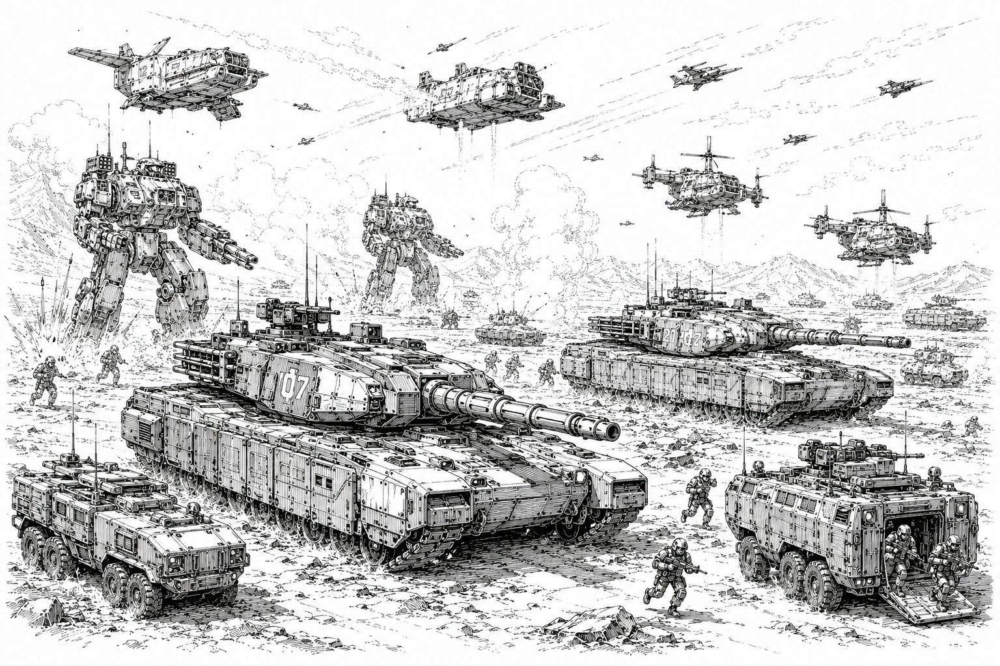
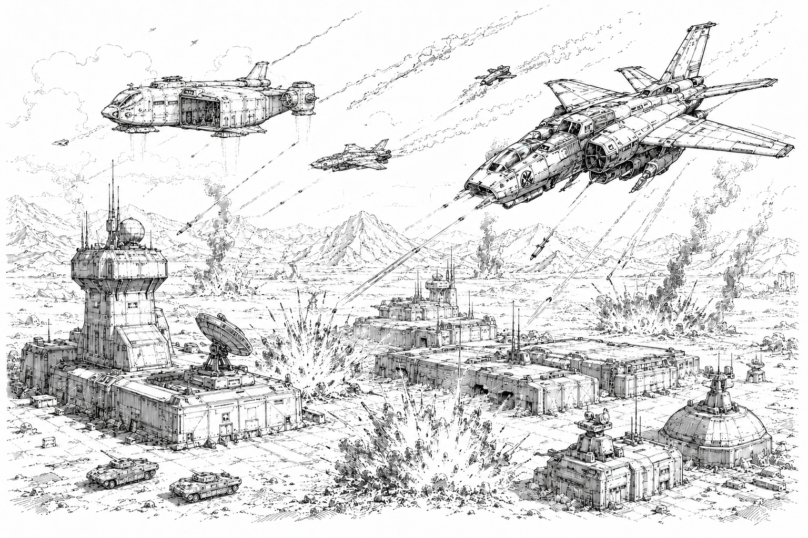
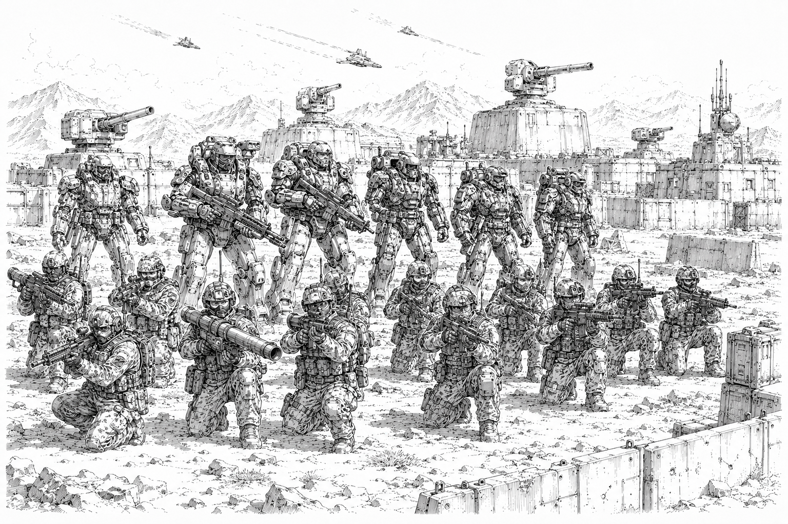

---

# Conventional Forces

> *"The battlefield belongs to mechs, but world belongs to whoever controls the roads, cities, and supply depots."*
>
> — Imperium strategic doctrine

While [War Mechs](../../mechs/) dominate modern warfare throughout the Core, they do not operate entirely alone. Every major power maintains vast conventional military forces consisting of aerospace fighters, gunships, armored vehicles, support units, and infantry.

Mechs are the decisive arm of modern warfare, capable of seizing objectives, breaking defensive lines, and defeating conventional formations with relatively little support. As a result, most military campaigns are planned around mech formations, with conventional forces serving in supporting roles.

Conventional forces remain essential for planetary defense, logistics, reconnaissance, occupation duties, border security, transportation, and long-term control of captured territory. Though they rarely decide major battles on their own, they provide the infrastructure and support necessary for mech forces to operate effectively.

In most campaigns, conventional forces greatly outnumber the mechs they support, even as the outcome of the conflict is often determined by the performance of a comparatively small number of mech units.

---

## Aerospace Fighters

Aerospace fighters are among the most versatile military assets in the Core.

Designed for both atmospheric and orbital operations, these craft serve as interceptors, escorts, reconnaissance platforms, and strike aircraft. Aerospace squadrons routinely protect larger warships, escort troop transports, conduct raids against enemy installations, and patrol national borders.

Conflicts between aerospace fighters are relatively common throughout the Core. Skirmishes, interceptions, and border incidents occur regularly between rival powers.

Large-scale fleet engagements, however, are rare. Capital ships are expensive to construct and difficult to replace, and any major fleet action is almost certain to attract the attention of the Star Regent and the Stellar Conclave.

Within planetary atmospheres, aerospace fighters provide close air support, reconnaissance, and rapid-response strike capabilities.

---

## Gunships and Dropships

Gunships and dropships form the backbone of military mobility.

Dropships transport troops, vehicles, supplies, and mechs between planets and from orbit to the battlefield. Though less maneuverable than aerospace fighters, they possess significantly greater cargo capacity and endurance.

Gunships are heavily armed atmospheric craft designed to support ground operations. While slower than aerospace fighters, they can remain over a battlefield for extended periods, providing direct fire support against infantry, vehicles, and fortified positions.

Many military operations rely heavily upon gunships to transport troops, reinforce threatened positions, and suppress enemy defenses.

---

## VTOL Craft

Vertical Take-Off and Landing (VTOL) craft occupy a niche between aircraft and ground vehicles. Capable of hovering, operating from improvised landing zones, and maneuvering through difficult terrain, VTOLs are commonly employed for reconnaissance, transport, logistics, and close air support.

Military forces throughout the Core make extensive use of VTOL scout craft to monitor enemy movements, identify targets, and coordinate artillery or aerospace strikes. Larger transport variants are frequently used to move infantry, supplies, and special operations teams into areas inaccessible to conventional vehicles.

Armed VTOL gunships provide valuable battlefield support against infantry, light vehicles, and fortified positions. However, their relatively low speed and vulnerability to anti-aircraft weapons make them ill-suited for direct engagement with aerospace fighters or concentrated mech formations.

While rarely as glamorous as aerospace fighters or as powerful as mechs, VTOLs remain among the most versatile and widely used military vehicles in the Core.

---

## Armored Vehicles

Despite the dominance of mechs, armored vehicles remain common throughout the Core.

### Main Battle Tanks

Modern tanks range from relatively agile light and medium vehicles to massive heavy tanks designed specifically to engage mechs. While even the largest tanks are smaller than most mechs, they are substantially larger and more heavily armed than contemporary armored vehicles from humanity's past.

Heavy tanks often mount oversized cannons, missile systems, and advanced targeting equipment intended to threaten mechs through concentrated firepower.

### Fire Support Vehicles

Dedicated support vehicles provide long-range missile bombardment, artillery support, electronic warfare capabilities, and battlefield command functions.

Many armies deploy mobile sensor platforms, radar vehicles, communication centers, and battlefield coordination units alongside frontline forces.

### Reconnaissance and Transport

Lighter vehicles perform scouting, reconnaissance, courier, and patrol duties. Armored personnel carriers and infantry fighting vehicles transport troops across dangerous terrain while providing limited protection and fire support.

Though vulnerable in direct combat against mechs, these vehicles remain invaluable for screening operations, rapid deployments, and planetary security duties.

### Artillery

Artillery remains an important component of modern armies, though its role has diminished since the rise of mechs.

Self-propelled guns, rocket artillery, and missile carriers are commonly used to bombard fixed positions, suppress defensive fortifications, and support large-scale military operations. Artillery is particularly effective against infantry concentrations, vehicle formations, and stationary targets.

Against mobile mech formations, however, artillery is far less decisive. Modern mechs possess advanced sensors, electronic countermeasures, active defenses, and exceptional mobility, making them difficult to target and destroy through indirect fire alone. As a result, artillery is typically employed in a supporting role rather than as a primary battlefield asset.

Despite these limitations, artillery remains invaluable for area denial, defensive operations, and the destruction of hardened targets.

---

## Infantry

Infantry remains the most numerous military force in the Core.

While infantry rarely decides major battles, soldiers perform countless tasks that mechs cannot efficiently accomplish. They secure facilities, patrol cities, occupy territory, guard supply lines, conduct reconnaissance, and maintain order in conquered regions.

Most infantry falls into one of two broad categories.

### Basic Infantry

Basic infantry consists of conventional soldiers equipped with rifles, machine guns, anti-vehicle weapons, mines, and support equipment.

Specialized units may carry portable anti-aircraft systems, anti-mech launchers, recoilless rifles, demolition charges, or electronic warfare equipment.

Infantry is rarely used in direct assaults against mech formations. Instead, soldiers typically rely upon ambushes, prepared defenses, minefields, and fortified positions to challenge larger opponents.

### Enhanced Infantry

Enhanced infantry utilizes powered exoskeletons and advanced combat equipment to improve mobility, endurance, and survivability.

Some exoskeletons provide increased speed, strength, and limited jump capabilities. Others incorporate substantial armor protection, creating heavily armed infantry units capable of threatening vehicles and even light mechs under favorable conditions.

Enhanced infantry is particularly effective in urban environments, dense terrain, and defensive operations.

Despite these advantages, even the most heavily equipped infantry remains vulnerable to direct engagement with mech formations.

---

## The Role of Infantry in Modern Warfare

Infantry rarely serves as the primary combat arm of major powers.

In the Core, most military campaigns are designed around mech formations supported by conventional assets. Once mech forces establish control of a battlefield, infantry typically follows to secure objectives, hold territory, police civilian populations, and eliminate remaining resistance.

Defensive forces may use infantry to establish fortified positions supported by turrets, minefields, anti-aircraft batteries, and vehicle formations. Such defenses can slow a mech advance and inflict casualties, but once the defensive line collapses, infantry units often withdraw rather than confront advancing mechs directly.

For this reason, most military theorists view infantry as a supporting arm rather than a decisive battlefield force.

---

## Naval Forces

Naval warfare is relatively uncommon throughout the Core.

Most inhabited worlds possess comparatively small populations concentrated around major cities, industrial centers, and transportation hubs. As a result, few governments invest heavily in large naval fleets, preferring instead to project power through aerospace assets capable of operating over both land and sea.

Where naval forces do exist, they are typically limited to coastal patrol vessels, transport ships, search-and-rescue craft, and local security forces. Aircraft and aerospace fighters perform most maritime reconnaissance and strike missions.

A handful of oceanic worlds maintain larger naval formations, but such forces are considered specialized exceptions rather than a major component of modern military doctrine.

---

## Modern Warfare

Modern warfare throughout the Core revolves around mechs.

While conventional forces remain important, War Mechs are the primary instrument through which military power is projected. Their combination of mobility, durability, and overwhelming firepower allows relatively small mech formations to defeat far larger conventional forces.

Military commanders commonly deploy mechs alongside infantry, armored vehicles, aerospace support, and logistical elements. Such combined-arms formations offer greater flexibility, improved reconnaissance, and more effective occupation of captured territory.

However, unlike conventional forces, mechs are capable of operating independently. Skilled pilots can perform orbital insertions directly into contested zones, destroy defensive positions, defeat conventional formations, and seize critical objectives without immediate support.

Once resistance has been broken, infantry, vehicles, and support personnel typically move in to secure territory, establish supply lines, and maintain long-term control of the region.

For this reason, most military theorists distinguish between winning battles and holding territory. Conventional forces excel at the latter. Mechs excel at the former.

Across the Core, wars are ultimately decided by the ability of one side's mechs to defeat the other's.