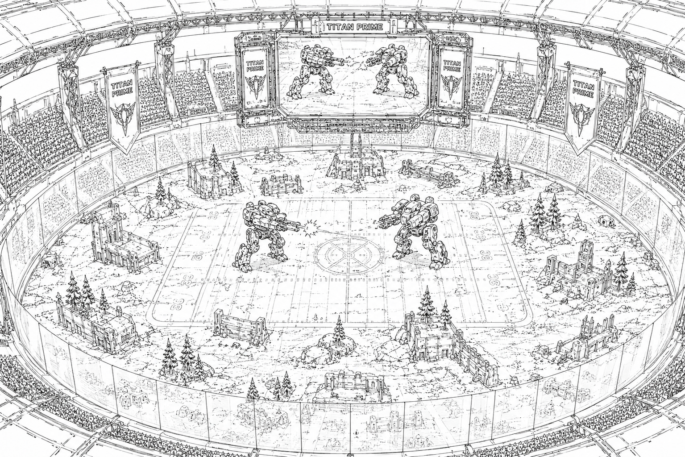

# Titan Prime

> *“On Titan Prime, a pilot can become immortal… or explode before the second round.”*  
> — Arena broadcast saying

## :material-sword-cross: Overview

|  |  |
|---|---|
| :material-map-marker: **Location** | Within Starcrest Protectorate Borders |
| :material-gavel: **Political Status** | Neutral World |
| :material-stadium: **Primary Function** | Gladiatorial Mech Combat |
| :material-television-play: **Major Industry** | Broadcasting and Arena Sports |
| :material-cash-fast: **Economic Driver** | Betting and Sponsorships |
| :material-book-open-page-variant: **Common Reputation** | “The Gladiator World” |

Titan Prime is the most famous gladiatorial world in the Core and the undisputed center of professional mech combat sports.

Known throughout civilized space as *The Gladiator World*, Titan Prime attracts:
- mercenary pilots
- House champions
- Free Jacks
- aspiring rookies
- corporate sponsors
- gamblers
- spectators

from across the Core and frontier alike.

The planet’s colossal arenas host high-profile mech battles broadcast to billions across known space.

To many citizens of the Core, Titan Prime represents:
- glory
- fame
- violence
- celebrity
- spectacle
- wealth

The world has become synonymous with mech combat entertainment itself.

## The Modern Games

Modern arena combat on Titan Prime is treated simultaneously as:
- sport
- entertainment
- military exhibition
- cultural spectacle

Pilots compete in a wide variety of formats including:
- duel matches
- lance battles
- team tournaments
- endurance campaigns
- elimination brackets
- live-fire exhibition events

The games attract everyone from:
- decorated veteran pilots
- House-sponsored champions
- mercenary celebrities
- desperate Free Jacks hoping for recognition

Victorious pilots can earn:
- enormous sponsorship deals
- Guild recognition
- celebrity status
- House recruitment offers
- lucrative contract opportunities

For many struggling mercenaries, a successful Titan Prime performance can permanently transform a career.

## Arena Culture

Titan Prime’s arenas are not merely battlegrounds.

They are stages.

Pilots are treated as:
- athletes
- celebrities
- military icons
- entertainment figures

Arena broadcasts dominate large portions of Core media culture.

Famous pilots frequently endorse:
- mech manufacturers
- reactor brands
- weapons systems
- Guild services
- combat stimulants
- luxury products

Some celebrity mech pilots possess fan followings rivaling major political figures.

Entire mech chassis configurations occasionally become fashionable after successful arena seasons.

Throughout the Core, countless young pilots dream of one day hearing their callsign announced before a packed Titan arena.

## Economy and Infrastructure

The economic impact of the games on Titan Prime is enormous.

The world supports massive industries centered around:
- broadcasting
- betting
- sponsorships
- mech repair
- mech manufacturing
- pilot training
- hospitality
- entertainment

Titan Prime contains some of the most advanced:
- training facilities
- mech servicing docks
- combat simulators
- arena engineering systems

in civilized space.

The planet’s economy is deeply tied to the continued popularity of the games.

Entire sectors of the Core economy are influenced by:
- betting markets
- sponsor networks
- arena licensing
- broadcast rights

## Betting and Gambling

Betting culture is deeply woven into Titan Prime society.

Fortunes are regularly:
- won
- lost
- manipulated
- destroyed

on the outcome of major matches.

Professional gamblers, data analysts, Guild brokers, and House-backed financial interests all participate heavily in arena wagering markets.

Some matches generate betting volumes rivaling major industrial trade exchanges.

This gambling culture contributes significantly to Titan Prime’s:
- excitement
- corruption
- celebrity obsession
- political influence

Among arena regulars, there is a common saying:

> *“The house always wins. The pilots just survive long enough to spend it.”*

## Historical Shadows

Despite the glamour of the modern games, Titan Prime’s origins remain deeply controversial.

Many historians note that the original coliseums were not built for entertainment.

They were built for punishment.

Long before the modern era of professional arena combat, Titan Prime’s arenas served as brutal theaters where:
- political prisoners
- prisoners of war
- criminals
- slaves

were forced to fight, often to the death.

## The Dark Beginnings

Historical records indicate that early arena organizers treated combatants as commodities rather than athletes.

Slavers and criminal syndicates reportedly purchased pilots directly and forced them into combat servitude.

Although a small number of successful fighters achieved fame and relative luxury, many remained effectively imprisoned within the arena system.

Public executions and lethal combat spectacles became normalized forms of mass entertainment.

Some historians argue that the modern games continue to romanticize this darker legacy.

Others maintain the current era represents a complete cultural transformation.

The subject remains politically sensitive on Titan Prime itself.

## The Ophidian Occupation

Ironically, the collapse of the original arena system occurred during the Ophidian Occupation.

Although the Occupation is remembered across the Core as an age of suffering and collapse, many historians view it as the turning point that ended the old gladiatorial slave system on Titan Prime.

When the games eventually returned decades later, Core society had changed dramatically.

Public executions, slave combat, and forced arena servitude had largely fallen out of favor throughout civilized space.

The reborn games were restructured as professional competitive sport rather than state-sanctioned execution.

This transformation permanently reshaped Titan Prime’s identity.

## The Modern Debate

Despite reforms, debate surrounding Titan Prime remains intense.

Critics argue the games still exploit:
- impoverished mercenaries
- desperate Free Jacks
- debt-ridden pilots
- psychologically damaged veterans

Supporters counter that modern arena pilots:
- compete voluntarily
- earn enormous rewards
- achieve social mobility
- inspire billions

Many pilots themselves openly embrace the risks.

Within mercenary culture, surviving Titan Prime is often viewed as proof of elite skill.

## The Great Houses and Titan Prime

All five Great Houses maintain a strong interest in Titan Prime.

The arenas serve as:
- recruitment grounds
- propaganda platforms
- technology showcases
- cultural influence centers

House-sponsored pilots frequently become major celebrities.

Political rivalries occasionally spill indirectly into arena competition, though official regulations prohibit overt inter-house warfare within Titan Prime events.

Unofficially, many observers suspect the arenas are used for:
- covert negotiations
- influence operations
- sponsorship wars
- intelligence gathering

beneath the spectacle of public entertainment.

## Mech Combat as Entertainment

Titan Prime helped transform mech warfare into mass entertainment across the Core.

Arena broadcasts have heavily influenced:
- popular culture
- mech aesthetics
- military propaganda
- sports culture
- civilian perceptions of warfare

Many critics within StarCom and the Regency quietly worry that generations of citizens raised on arena broadcasts increasingly view warfare itself as spectacle rather than tragedy.

Others argue the games provide a safe outlet for humanity’s fascination with violence and competition.

## Public Reputation

Throughout civilized space, Titan Prime is viewed as:
- glamorous
- dangerous
- legendary
- excessive
- corrupt
- culturally influential

To mercenaries, it represents opportunity.

To the Great Houses, it is a useful political and cultural instrument.

To critics, it is proof that the Core remains obsessed with violence beneath its veneer of civilization.

To billions of ordinary citizens, however, Titan Prime remains simple:

the greatest show in the galaxy.

## Modern Outlook

Titan Prime’s influence continues to grow with every passing decade.

As mech combat culture expands across the Core, the arenas increasingly shape:
- public opinion
- military celebrity
- mech design trends
- sponsorship economies
- mercenary recruitment

Some analysts believe Titan Prime now exerts more cultural influence than entire planetary governments.

Whether viewed as noble sport, exploitative spectacle, or civilized gladiatorial warfare, one truth remains undeniable:

when the arena lights ignite on Titan Prime, the entire Core watches.